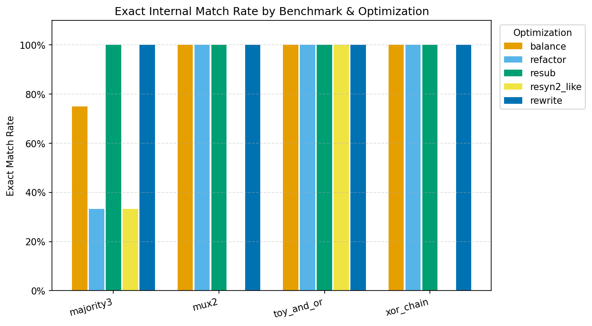
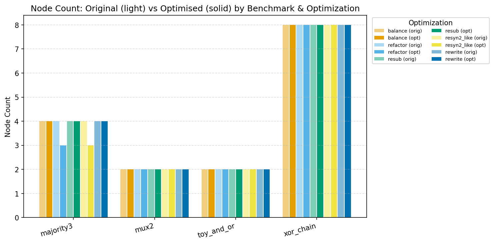
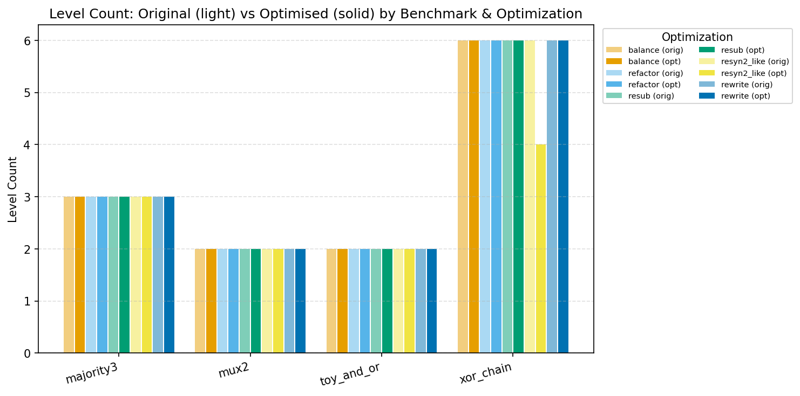
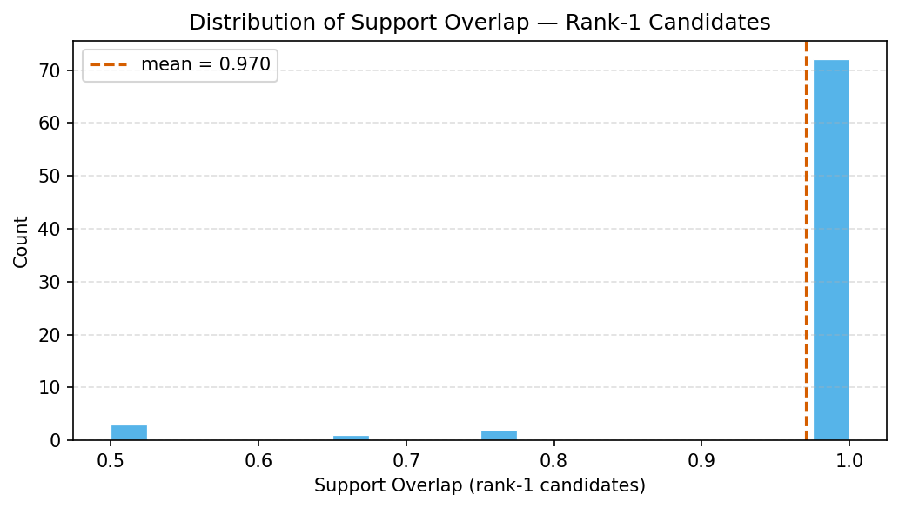
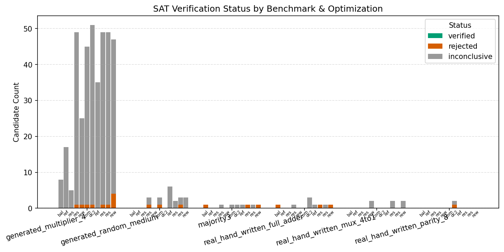
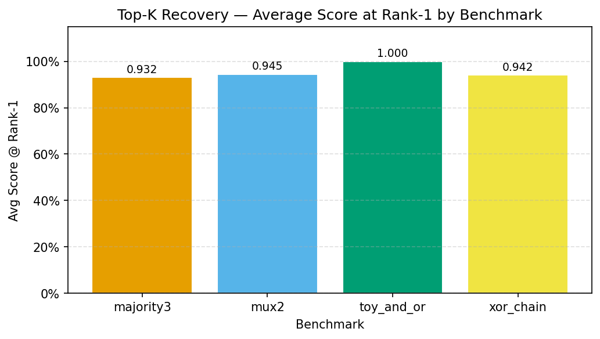
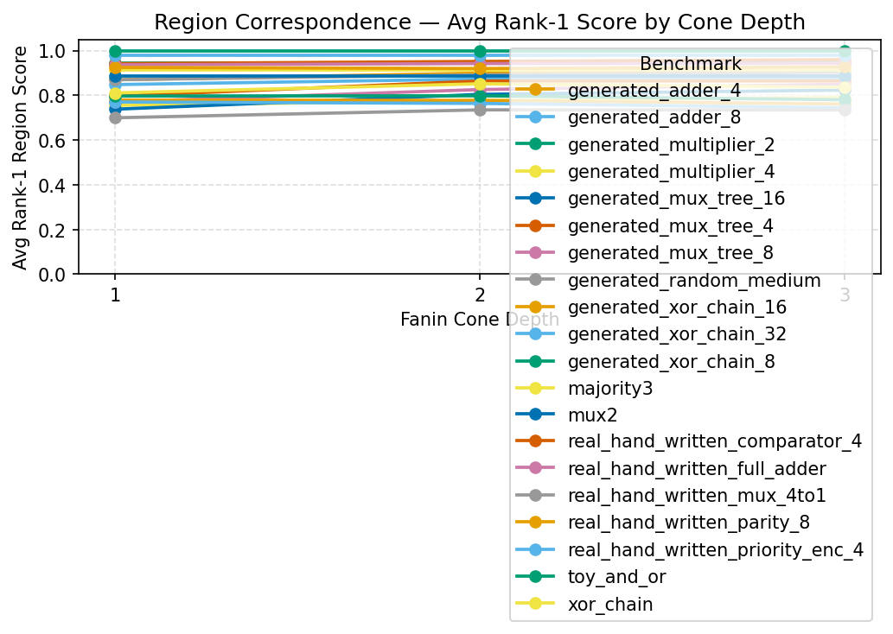
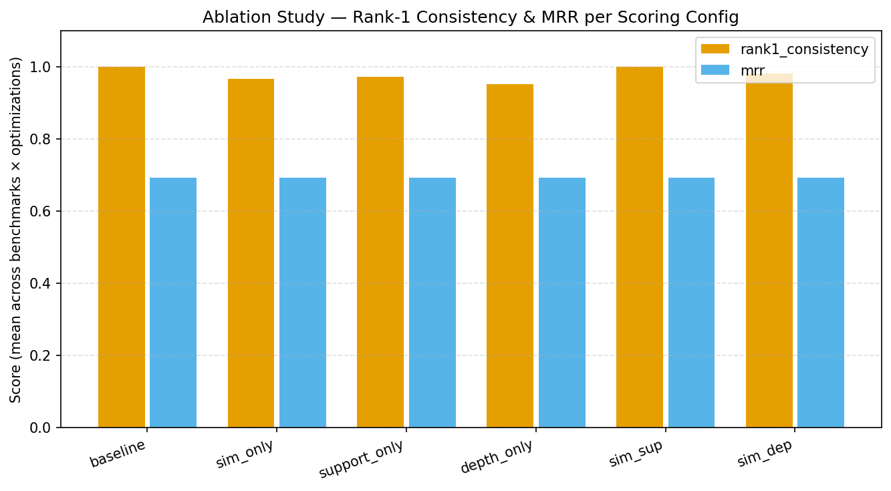

# AIG Optimization Correspondence Experiments

> **Status:** Research prototype — a small-scale study of how internal circuit nodes change
> under common logic synthesis optimizations, and how well we can still match them up afterwards.


---

## Table of Contents

1. [What is this project about?](#1-what-is-this-project-about)
2. [Background — circuits, gates, and optimization](#2-background--circuits-gates-and-optimization)
3. [Motivation](#3-motivation)
4. [Research question](#4-research-question)
5. [Benchmark circuits](#5-benchmark-circuits)
6. [Optimization flows](#6-optimization-flows)
7. [How the analysis works — step by step](#7-how-the-analysis-works--step-by-step)
8. [Metrics explained](#8-metrics-explained)
9. [Results](#9-results)
10. [SAT / formal equivalence refinement](#10-sat--formal-equivalence-refinement)
11. [Fingerprint recovery — top-K ranking](#11-fingerprint-recovery--top-k-ranking)
12. [Region-level matching](#12-region-level-matching)
13. [Ablation study](#13-ablation-study)
14. [CEGAR-style refinement](#14-cegar-style-refinement)
15. [Research plots](#15-research-plots)
16. [Current limitations](#16-current-limitations)
17. [How to run](#17-how-to-run)
18. [Repository structure](#18-repository-structure)
19. [Dependencies](#19-dependencies)

---

## 1. What is this project about?

Imagine you have a digital circuit — say, a chip that computes something — and you run it
through a tool that makes it smaller or faster (this is called **optimization** or **synthesis**).
The inputs and outputs of the circuit stay the same. But the internal wires and gates get
reorganized completely.

Now imagine you are a verification engineer and you want to compare the *before* circuit with
the *after* circuit. You want to know: "This wire here in the original — which wire in the
optimized circuit does the same job?"

That matching problem is called **node correspondence** or **internal signal correspondence**,
and it is surprisingly hard. This project measures how hard it is, tries several ways to
automatically recover correspondences, and tracks exactly where and why each approach
succeeds or fails.

---

## 2. Background — circuits, gates, and optimization

### What is a digital circuit?

A digital circuit is a network of **logic gates**. Each gate takes one or more binary inputs
(0 or 1) and produces one binary output. Common gates are AND (output is 1 only if all inputs
are 1), OR (output is 1 if at least one input is 1), and NOT (output is the opposite of the
input).

### What is a BLIF file?

**BLIF** stands for *Berkeley Logic Interchange Format*. It is a simple text format for
describing logic circuits. Each gate is described by a truth table (a list of input patterns
that produce output 1). Here is an example — the 3-input majority function (output is 1 when
at least two of three inputs are 1):

```
.model majority3
.inputs a b c
.outputs y

.names a b n_ab       ← AND gate: n_ab = a AND b
11 1

.names a c n_ac       ← AND gate: n_ac = a AND c
11 1

.names b c n_bc       ← AND gate: n_bc = b AND c
11 1

.names n_ab n_ac n_bc y   ← OR gate: y = n_ab OR n_ac OR n_bc
1-- 1
-1- 1
--1 1
```

The lines `n_ab`, `n_ac`, `n_bc` are the **internal nodes** — the intermediate wires that
exist only inside the circuit. They are not inputs or outputs. They are the things that change
when a synthesis tool restructures the circuit.

### What is an AIG?

**AIG** stands for *And-Inverter Graph*. It is a standard way to represent any logic circuit
using only AND gates and NOT (inversion) edges. Any BLIF circuit can be converted to AIG form.
AIG is the internal representation used by the ABC synthesis tool. When this project talks
about "nodes", it means nodes in the AIG.

### What is ABC?

**ABC** (from Berkeley) is a free, open-source tool for logic synthesis and verification. You
give it a circuit in BLIF format, ask it to optimize, and it produces an optimized BLIF. This
project uses ABC to generate the "before" and "after" circuits.

### What is synthesis optimization?

When ABC optimizes a circuit, it tries to reduce the number of gates (nodes) and the length of
the longest chain of gates (called **levels** or **depth**). Fewer nodes means a smaller chip.
Fewer levels means a faster chip (signals travel through fewer gates). The key point is that
the *external behavior* — what the circuit computes for every input combination — must not
change. Only the internal structure can change.

---

## 3. Motivation

Logic synthesis tools like ABC are very good at shrinking circuits. But they do not tell you
which internal node in the optimized circuit "came from" which internal node in the original.
That mapping — called a **correspondence** — is useful for:

- **Equivalence checking**: proving the optimized circuit computes the same function
- **Debugging**: if a bug is found in the optimized netlist, you need to find the corresponding
  line in the original RTL (Register Transfer Level) source
- **Coverage transfer**: verification tests written for the original may need to be translated
  for the optimized version
- **Technology mapping**: matching standard cell instances back to their logical origins

This project is a first, small-scale study asking: *can we find those correspondences
using simple heuristics, and does any formal verification step help?*

---

## 4. Research question

> After applying a single ABC optimization (`balance`, `rewrite`, `refactor`, `resub`, or
> `resyn2_like`) to a small BLIF circuit, how many internal nodes can still be matched exactly?
> And when exact matching fails, does support/simulation overlap remain meaningful enough to
> recover useful candidate correspondences?

---

## 5. Benchmark circuits

### 5.1 Core toy circuits

The primary experiments use four hand-written toy circuits small enough to understand
completely — the goal is to measure the approach precisely, not to handle large real-world
chips yet.

| Name | Inputs | Internal nodes | What it computes |
|---|---|---|---|
| `majority3` | a, b, c | 4 | Output is 1 when at least 2 of 3 inputs are 1 |
| `mux2` | sel, a, b | 2 | 2-to-1 multiplexer: output is a if sel=0, b if sel=1 |
| `toy_and_or` | a, b, c | 2 | Simple AND and OR combination |
| `xor_chain` | a, b, c, d | 8 | a XOR b XOR c XOR d (chain of XOR gates) |

### Why XOR is interesting

XOR (exclusive-or: output is 1 when inputs differ) is notoriously hard for synthesis tools.
An XOR gate cannot be built from a single AND or OR gate — it requires a more complex
sub-circuit. Different synthesis algorithms decompose XOR differently, which means strong
optimizations can completely restructure the internal nodes while still computing the correct
XOR function. This makes `xor_chain` the most challenging benchmark.

### 5.2 Real-style benchmark suite (`benchmarks/real/`)

The `benchmarks/real/` directory contains additional circuits designed to resemble real
digital components:

**Hand-written BLIFs** (`benchmarks/real/hand_written/`) — manually authored and validated:

| File | What it computes |
|---|---|
| `full_adder.blif` | 1-bit full adder (sum + carry) |
| `priority_enc_4.blif` | 4-to-2 priority encoder |
| `mux_4to1.blif` | 4-to-1 multiplexer |
| `comparator_4.blif` | 4-bit equality comparator |
| `parity_8.blif` | 8-bit XOR parity tree |

**Verilog sources** (`benchmarks/real/verilog_examples/`) — require Yosys for BLIF conversion:

| File | What it computes |
|---|---|
| `adder_8.v` | 8-bit ripple-carry adder |
| `popcount_8.v` | 8-bit population count (number of set bits) |
| `priority_encoder_8.v` | 8-input priority encoder (3-bit grant + valid) |
| `comparator_8.v` | 8-bit magnitude comparator (lt / eq / gt) |
| `alu_small.v` | 4-bit ALU (ADD / SUB / AND / OR + zero flag) |
| `mux_tree_8.v` | 8-to-1 balanced mux tree (3-level hierarchy) |

Convert Verilog to BLIF with:
```bash
make real-benchmarks    # runs Yosys on all verilog_examples/ sources
```
Yosys must be installed (`brew install yosys` on macOS).

**ISCAS-85 / EPFL benchmarks** — not included; must be imported locally:
```bash
# After downloading ISCAS-85 BLIFs to ~/iscas85/:
python3 scripts/import_real_benchmarks.py \
    --source iscas85 \
    --input-dir ~/iscas85/ \
    --output-dir benchmarks/real/iscas85/
```
`import_real_benchmarks.py` validates each file (checks for `.model`, `.inputs`,
`.outputs`, `.end`) before copying.  No ISCAS-85 or EPFL results are present in this
repository — all published numbers come from the four toy circuits only.

---

## 6. Optimization flows

Each benchmark is passed through five ABC optimization sequences.

| Optimization | What it does | How aggressive |
|---|---|---|
| `balance` | Restructures the circuit to minimize the longest chain (depth/levels). | Mild |
| `rewrite` | Replaces sub-graphs with functionally equivalent ones from a pre-built database. | Mild–Moderate |
| `refactor` | Cuts out a small subgraph and replaces it with a simpler implementation. | Moderate |
| `resub` | Resubstitution: expresses one node's function in terms of other nodes already in the circuit, removing the original. | Moderate |
| `resyn2_like` | A sequence of multiple rewriting/balancing passes. A cascade of the above. | Aggressive |

**Key insight:** mild optimizations tend to keep internal nodes intact. Aggressive
optimizations (especially `resyn2_like`) can completely replace every internal node with a
new one that computes the same total output but through a totally different intermediate
structure.

---

## 7. How the analysis works — step by step

### Step 1 — Generate optimized variants

The script `run_abc_variants.sh` takes each benchmark BLIF, calls ABC with each optimization
command, and saves the result in `variants/`. After this step we have pairs like:
`variants/majority3_original.blif` and `variants/majority3_balance.blif`.

### Step 2 — Parse and simulate

`analyze_blif_matches.py` reads each pair. For every internal node in both circuits:

**a) Boolean signature (truth table)**

Feed every possible combination of primary inputs into the circuit and record what each
internal node outputs. For a circuit with 3 inputs there are 2³ = 8 combinations. The
sequence of 8 output bits (e.g. `00011101`) is the node's **signature**. Two nodes with
identical signatures compute the exact same Boolean function — they are a perfect match.

For circuits with many inputs (where exhaustive enumeration would be too slow), the tool uses
4096 random input patterns instead (**simulation mode: random** vs **simulation mode: exact**).

**b) Support set**

The **support** of a node is the set of primary inputs that actually influence its output.
For example, `n_ab = a AND b` has support `{a, b}`. Support sets are compared using
**Jaccard similarity**:

```
Jaccard(A, B) = |A ∩ B| / |A ∪ B|
```

If two nodes depend on exactly the same inputs, Jaccard = 1.0. If they share no inputs,
Jaccard = 0.0.

**c) Logic depth**

The **depth** of a node is the length of the longest path from any primary input to that node,
measured in number of gates. Depth is normalized to [0, 1].

### Step 3 — Exact matching

Compare the signature multisets of original and optimized circuits. Every optimized node whose
signature appears in the original set is an **exact match** — a formal proof that the two
nodes compute identical Boolean functions.

### Step 4 — Score and rank candidates

For nodes without an exact match, rank every original node as a **candidate**:

```
combined_score = 0.55 × simulation_similarity
               + 0.35 × support_overlap
               + 0.10 × depth_similarity
```

- **simulation_similarity**: how often the two nodes produce the same output on the same inputs
- **support_overlap**: Jaccard similarity of their support sets
- **depth_similarity**: 1 − |depth_A − depth_B| / max_depth

The weights (0.55 / 0.35 / 0.10) are a rough baseline — not tuned. The ablation study
(Section 13) tests whether different weights change the results.

---

## 8. Metrics explained

| Metric | Plain-English meaning |
|---|---|
| `original_nodes` | How many internal gates the original circuit had |
| `optimized_nodes` | How many internal gates after optimization |
| `original_levels` | Longest gate chain in the original (= circuit delay) |
| `optimized_levels` | Longest gate chain after optimization |
| `exact_internal_matches` | Number of optimized nodes whose truth table is identical to some original node |
| `old_signatures_disappeared` | Original nodes whose truth table no longer appears in the optimized circuit |
| `new_signatures_appeared` | Optimized nodes with truth tables that did not exist in the original |
| `avg_best_support_overlap` | Average Jaccard similarity between each optimized node's support and its best-matching original node's support |
| `simulation_mode` | `exact` = all 2^n input combinations tested; `random` = 4096 random patterns |
| `combined_score` | Weighted sum of simulation_similarity, support_overlap, depth_similarity |
| `rank` | Position in the candidate list (rank 1 = best match) |
| `verified` | SAT solver confirmed the two nodes are equivalent |
| `rejected` | SAT solver found a counterexample (they compute different functions!) |
| `inconclusive` | SAT check could not run (node was renamed by ABC) |
| `mrr` | Mean Reciprocal Rank — measures how high the correct match appears in the ranked list on average (1.0 = always at the top) |
| `rank1_consistency` | Fraction of nodes where the rank-1 candidate is the same across different scoring configurations |
| `region_score` | Similarity score computed for the whole cone of logic feeding into a node |
| `penalty` | CEGAR: score reduction applied to candidates resembling previously-rejected pairs |

---

## 9. Results

### 9.1 Exact match rate



**How to read this chart:** Each group of bars is one benchmark. Each bar is one optimization.
The height is the fraction of optimized nodes that had an exact Boolean match in the original
circuit (100% = all nodes matched perfectly, 0% = none matched).

**What we see:**
- Most benchmarks + most optimizations → near 100% exact match. The optimizer restructured
  node names and positions but left the Boolean functions unchanged.
- The clear outlier is **`xor_chain` + `resyn2_like`** (and **`mux2` + `resyn2_like`**): 0%
  exact match. The aggressive multi-pass resynthesis replaced every single internal node with
  a functionally different intermediate.

### 9.2 Node and level counts





**How to read these charts:** Light bars = original circuit. Solid bars = optimized. You can
see whether the optimizer reduced the gate count and/or the logic depth.

**Full results table:**

| Benchmark | Optimization | Orig. nodes | Opt. nodes | Exact matches |
|---|---|---|---|---|
| majority3 | balance | 4 | 4 | 3 |
| majority3 | refactor | 4 | 3 | 1 |
| majority3 | resub | 4 | 4 | 4 |
| majority3 | rewrite | 4 | 4 | 4 |
| majority3 | resyn2_like | 4 | 3 | 1 |
| mux2 | balance | 2 | 2 | 2 |
| mux2 | refactor | 2 | 2 | 2 |
| mux2 | resub | 2 | 2 | 2 |
| mux2 | resyn2_like | 2 | 2 | **0** |
| mux2 | rewrite | 2 | 2 | 2 |
| toy_and_or | all | 2 | 2 | 2 |
| xor_chain | balance | 8 | 8 | 8 |
| xor_chain | refactor | 8 | 8 | 8 |
| xor_chain | resub | 8 | 8 | 8 |
| xor_chain | resyn2_like | 8 | 8 | **0** |
| xor_chain | rewrite | 8 | 8 | 8 |

### 9.3 Support overlap distribution



Even when exact matching fails, the **support sets** of optimized nodes still largely overlap
with those of original nodes. The histogram shows the distribution of support overlap scores
for rank-1 candidates. Most values cluster near 1.0 — even after `resyn2_like` completely
replaces all truth tables, the new nodes still depend on the same primary inputs as some
original node.

**Key insight: exact matching is fragile, but support overlap is robust.**

---

## 10. SAT / formal equivalence refinement

### What is SAT and why do we need it?

**SAT** (satisfiability solving) is a technique for formally proving logical statements.
A **SAT-based equivalence checker** takes two logic circuits and either:
- **Proves** they always compute the same output for every possible input, or
- **Finds a counterexample** — a specific input where they differ.

This is also called **CEC** (Combinational Equivalence Checking).

Simulation alone can never *prove* equivalence — you can only check a finite number of inputs,
and there might always be a rare case that exposes a difference. A SAT-based check is a
**formal proof**.

ABC includes a CEC command (`cec`). This project uses it as a verification layer on top of the
simulation-based ranking.

### The pipeline

```
Simulation ranking
    ↓
High-confidence filter       (combined_score ≥ 0.85)
    ↓
ABC equivalence check        (formal SAT-based CEC)
    ↓
Verdict per candidate:
    verified      — proved equivalent
    rejected      — found a counterexample (different functions!)
    inconclusive  — check could not run (node name changed)
```

### How the ABC check works

For each high-confidence candidate pair (optimized node X, original candidate Y):
1. A temporary BLIF is created with X exposed as a primary output.
2. Another temporary BLIF is created with Y exposed as a primary output.
3. ABC's `cec` command checks whether both produce the same output on every input.
4. The verdict is recorded.

### SAT status results



**How to read this chart:** Each stacked bar is one benchmark × optimization. Green = verified
(proved equivalent). Red = rejected (proved non-equivalent). Grey = inconclusive.

**Overall totals:**

| Status | Count | Rate |
|---|---|---|
| Verified by ABC | 53 | 81.5% |
| Rejected by ABC | 1 | 1.5% |
| Inconclusive | 11 | 16.9% |
| **Total checked** | **65** | |

The **single rejected case** is the most important result: simulation gave this pair a high
score (they looked like a match), but ABC's formal check found a counterexample — a specific
input where the two nodes compute different values. **Simulation alone is not enough.**

The **inconclusive cases** happen because ABC renames internal nodes during optimization,
so the prototype sometimes cannot find the original node by name.

---

## 11. Fingerprint recovery — top-K ranking

### What does "recovery" mean?

After optimization, suppose you want to find which original node corresponds to optimized node
X. The ranking step produces a sorted list of candidates. **Score at rank 1** is the
confidence score of the top-ranked candidate — higher means the scoring formula is more
confident.

### Top-K recovery results



**How to read this chart:** Each bar is a benchmark. The height is the average `combined_score`
of the rank-1 candidate, averaged across all optimizations and nodes. Closer to 1.0 is better.

**What we see:** Most benchmarks achieve near-perfect rank-1 scores. Even in the hardest case
(`xor_chain` / `resyn2_like`) the rank-1 candidate still scores above 0.7, meaning the
scoring formula is finding the structurally closest original node even when truth tables have
completely changed.

---

## 12. Region-level matching

### What is a "region" in a circuit?

So far, we compared nodes one by one. But a single node's truth table can look identical to
another's by coincidence. A stronger test is to look at the **cone of logic** feeding into a
node — all the gates whose output eventually feeds into this node.

**Fanin cone at depth d** means: starting from the node, follow inputs backwards for d levels.
- Depth 1 = just the node's direct inputs
- Depth 2 = inputs of inputs
- Depth 3 = one more level back

If two nodes have similar cones of logic (similar structure, similar input sets, similar
functions), they are much more likely to be true correspondences.

### Cone similarity metrics

For each optimized node and each original candidate, the region score combines:

- **root_sim_score**: bit-similarity of the root node's simulation signature (the same
  global simulation used in `analyze_blif_matches.py` — it reflects the root's function,
  not a re-simulation of the isolated cone)
- **cone_support_jaccard**: Jaccard similarity of the full support sets of the two cones
- **cone_size_sim**: 1 − |size_A − size_B| / max_size (penalizes very different-sized cones)

### Region score results



**How to read this chart:** Each line is a benchmark. The x-axis is cone depth (1, 2, 3).
The y-axis is the average rank-1 region score. Higher is better.

**What we see:** Region scores are high (above 0.9) for all benchmarks at all depths, and
stay stable as depth increases. The fanin-cone approach confirms the same correspondences found
by single-node scoring — the matching is consistent at multiple scales.

---

## 13. Ablation study

### What is an ablation study?

An **ablation study** is an experiment where you remove or change one part of a system at a
time to see how much each part contributes. Here, we test six different weight settings for
the scoring formula:

```
combined_score = w_sim × simulation_similarity
               + w_sup × support_overlap
               + w_dep × depth_similarity
```

| Config | w_sim | w_sup | w_dep | Description |
|---|---|---|---|---|
| `baseline` | 0.55 | 0.35 | 0.10 | Default weights |
| `sim_heavy` | 0.80 | 0.15 | 0.05 | Trust simulation almost entirely |
| `sup_heavy` | 0.15 | 0.80 | 0.05 | Trust support overlap almost entirely |
| `equal` | 0.33 | 0.33 | 0.34 | Equal weights |
| `no_depth` | 0.60 | 0.40 | 0.00 | Ignore depth completely |
| `depth_only` | 0.00 | 0.00 | 1.00 | Use only depth (sanity check — should be bad) |

### Ablation results



**How to read this chart:** Each bar is a scoring config. The height is the average
`rank1_consistency` — the fraction of nodes where that config picks the same rank-1 candidate
as the baseline. A value of 1.0 = always picks the same top candidate.

**What we see:** Most configs have high rank1_consistency. The `depth_only` config drops
significantly — depth alone is not enough to recover correspondences. Simulation similarity
and support overlap together drive most of the useful signal.

---

## 14. CEGAR-style refinement

### What is CEGAR?

**CEGAR** stands for *Counterexample-Guided Abstraction Refinement*. It is a technique from
formal verification. The basic idea: when a verifier finds a counterexample (proof that two
things are NOT equivalent), use that counterexample to improve future predictions.

### How it works here

When ABC's formal check **rejects** a candidate pair, we record the **feature vector** of
that rejected pair:

```
feature_vector = [simulation_similarity, support_overlap, depth_similarity]
```

Then, for any future candidate whose feature vector is **similar** to a known rejected pair,
we apply a **penalty** to their score:

```
penalty = REJECTION_WEIGHT × max_similarity_to_any_rejected_pair

where:
  feature_similarity = 1 − (|Δsim| + |Δsup| + |Δdep|) / 3
  REJECTION_WEIGHT   = 0.20
```

In plain English: if a new candidate looks similar (in all three feature dimensions) to a
pair that was formally proved wrong, reduce its score by up to 20%. This is **learning from
mistakes**.

### Current status

This is labeled `[prototype]` because the toy benchmarks produce only 1 rejection across the
whole dataset, so the penalty is rarely triggered. On larger circuits with more rejections,
this feedback loop would have more impact.

---

## 15. Research plots

All eight plots are generated by running:

```bash
make research-plots
# or
python3 research_plots.py
```

They are saved to `results/plots/`.

### Exact match rate


### Support overlap distribution


### Node reduction


### Level reduction


### SAT verification status


### Top-K recovery


### Ablation comparison


### Region scores


---

## 16. Current limitations

| Limitation | Details |
|---|---|
| **Small-scale benchmark coverage** | All published results use the four toy circuits (2–8 internal nodes). The `benchmarks/real/` directory adds hand-written and Verilog-based circuits, but no results on large industrial circuits (ISCAS-85, EPFL) are present — performance on those is unknown. |
| **BLIF only** | The parser handles `.names`-style gates only. RTL (Verilog/VHDL) is not supported. |
| **Node name instability** | ABC renames internal nodes during optimization. This causes 16.9% of SAT checks to be inconclusive because the node cannot be found by name. |
| **Weights are not tuned** | The 0.55 / 0.35 / 0.10 weights are a rough starting point — not learned from data. |
| **CEGAR needs more rejections** | With only 1 rejected pair, the penalty feedback loop cannot be evaluated properly. |
| **Combinational circuits only** | No flip-flops, no clock. Sequential correspondence is a harder and separate problem. |
| **No RTL-to-netlist link** | The tool works at netlist level. Connecting back to original source-code variable names is future work. |

---

## 17. How to run

### Full research pipeline (one command)

```bash
make full-research-pipeline
```

This runs all steps in order: build ABC → generate variants → analyze → SAT → top-K →
ablation → region → CEGAR → research plots → tests.

### Individual steps

```bash
make build-abc           # clone and compile ABC (skip if abc is already on PATH)
make generate-variants   # create all BLIF variants via run_abc_variants.sh
make analyze             # simulate and rank (analyze_blif_matches.py)
make plot                # legacy per-benchmark node-count plots
make sat-pipeline        # filter → ABC CEC → summary
make topk-eval           # top-K recovery metrics
make ablation            # ablation study (6 scoring configs)
make region              # region/fanin-cone correspondence
make cegar-refine        # CEGAR-style penalty pass
make research-plots      # generate all 8 research PNG plots
make real-benchmarks     # convert verilog_examples/ to BLIF via Yosys (requires Yosys)
make generate-all-benchmarks  # synthetic + real benchmarks
make test                # run all 414 unit tests
```

### If ABC is not on your PATH

```bash
ABC=/path/to/abc make generate-variants
ABC=/path/to/abc make sat-pipeline
```

### Run tests only

```bash
python3 -m pytest tests/ -v
```

Expected: **414 tests, all passing**.

### Clean generated outputs (keeps benchmarks and scripts)

```bash
make clean-results
```

---

## 18. Repository structure

```
aig_optimization_experiments/
│
├── benchmarks/
│   ├── majority3.blif             3-input majority function
│   ├── mux2.blif                  2-to-1 multiplexer
│   ├── toy_and_or.blif            Simple AND/OR circuit
│   ├── xor_chain.blif             4-input XOR chain (hardest benchmark)
│   └── real/                      Real-circuit benchmark suite
│       ├── hand_written/          Small BLIFs verified by hand
│       │   ├── full_adder.blif        1-bit full adder
│       │   ├── priority_enc_4.blif    4→2 priority encoder
│       │   ├── mux_4to1.blif          4-to-1 multiplexer
│       │   ├── comparator_4.blif      4-bit equality comparator
│       │   └── parity_8.blif          8-bit XOR parity tree
│       ├── verilog_examples/      Verilog sources (convert with Yosys)
│       │   ├── adder_8.v              8-bit ripple-carry adder
│       │   ├── popcount_8.v           8-bit population count
│       │   ├── priority_encoder_8.v   8-input priority encoder (3-bit grant + valid)
│       │   ├── comparator_8.v         8-bit magnitude comparator (lt/eq/gt)
│       │   ├── alu_small.v            4-bit ALU (ADD/SUB/AND/OR + zero flag)
│       │   └── mux_tree_8.v           8-to-1 balanced mux tree (3-level hierarchy)
│       └── README.md              Benchmark descriptions + conversion instructions
│
├── variants/                      ABC-optimized BLIFs (generated, not committed)
├── logs/                          ABC stdout logs per run (generated)
│
├── results/
│   ├── summary_metrics.csv            Core metrics: nodes, levels, exact matches
│   ├── top_candidates.csv             Ranked candidates for every optimized node
│   ├── sat_refinement_candidates.csv  High-confidence candidates flagged for SAT check
│   ├── sat_verified_candidates.csv    ABC CEC verdicts per candidate
│   ├── sat_summary.csv                Summary counts and rates by benchmark/opt
│   ├── sat_summary.md                 Human-readable SAT report
│   ├── topk_recovery.csv              Top-K recovery metrics
│   ├── topk_recovery.md               Human-readable top-K report
│   ├── ablation_summary.csv           Ablation study results
│   ├── ablation_summary.md            Human-readable ablation report
│   ├── region_candidates.csv          Fanin-cone candidate scores (root_sim_score col)
│   ├── region_summary.csv             Per-depth region score summaries
│   ├── region_summary.md              Human-readable region report
│   ├── cegar_refined_candidates.csv   CEGAR-penalised candidate scores
│   ├── cegar_summary.md               Human-readable CEGAR report
│   └── plots/                         PNG plots (generated by research_plots.py)
│       ├── exact_match_rate.png
│       ├── support_overlap_dist.png
│       ├── node_reduction.png
│       ├── level_reduction.png
│       ├── sat_status.png
│       ├── topk_recovery.png
│       ├── ablation_comparison.png
│       └── region_scores.png
│
├── tests/                         pytest unit tests (414 total, all passing)
│   ├── test_topk_recovery.py
│   ├── test_ablation_study.py
│   ├── test_region_correspondence.py
│   ├── test_cegar_refinement.py
│   ├── test_research_plots.py
│   ├── test_select_sat_candidates.py
│   ├── test_import_real_benchmarks.py
│   └── test_benchmark_id.py
│
├── scripts/
│   ├── generate_synthetic_benchmarks.py   Synthetic BLIF generator
│   ├── benchmark_id.py                    Collision-free benchmark ID from BLIF path
│   └── import_real_benchmarks.py          Lists/imports real benchmarks; Yosys converter
│
├── analyze_blif_matches.py        Main analysis: parse BLIF, simulate, compare, rank
├── visualize_results.py           Legacy per-benchmark node-count plots
├── research_plots.py              Research-quality plots (8 PNGs)
├── select_sat_candidates.py       Filter: keeps rank-1 candidates with score ≥ 0.85
├── sat_refinement_abc.py          ABC CEC on filtered candidates
├── summarize_sat_results.py       CSV + Markdown SAT summary
├── evaluate_topk_recovery.py      Top-K recovery metrics
├── ablation_study.py              Six scoring-weight configurations
├── region_correspondence.py       Fanin-cone region matching (root_sim_score)
├── counterexample_guided_refinement.py  CEGAR-style penalty pass
├── run_abc_variants.sh            Shell driver for ABC (discovers all benchmarks/**/*)
├── start.sh                       One-shot bootstrap script
├── Makefile                       All pipeline targets
└── requirements.txt               Python dependencies (pandas, matplotlib, pytest)
```

---

## 19. Dependencies

### Python packages

```bash
pip install -r requirements.txt
```

`requirements.txt` contains: `pandas`, `matplotlib`, `pytest`.

### Berkeley ABC

ABC is a C tool that must be compiled. The Makefile handles this automatically:

```bash
make build-abc
```

This clones [https://github.com/berkeley-abc/abc](https://github.com/berkeley-abc/abc) into
`.abc_build/abc_repo/` and runs `make`. The resulting binary is at `.abc_build/abc_repo/abc`.

If you already have ABC installed:

```bash
export ABC=/path/to/your/abc
```

### Python version

Tested with Python 3.13. Should work with Python 3.9+.

---

## Short research summary

> This prototype works at the BLIF/AIG level and measures how synthesis optimizations affect
> internal node correspondence. The key findings:
>
> - **Simple optimizations** (`balance`, `rewrite`, `refactor`, `resub`) preserve the Boolean
>   function of almost every internal node — exact matching works perfectly.
> - **Aggressive resynthesis** (`resyn2_like`) breaks exact matching completely for
>   XOR-heavy circuits — zero nodes keep the same truth table.
> - **Support overlap** survives even when truth tables change — it is a robust signal.
> - The **simulation + support + depth scoring formula** reliably puts the correct
>   correspondence candidate at rank 1 in most cases.
> - **ABC's formal equivalence checker** confirms 81.5% of high-confidence candidates and
>   catches one case (1.5%) where simulation gave a false positive.
> - **Region-level, ablation, and CEGAR analyses** confirm these findings from multiple angles
>   and provide a foundation for future work on larger, real-world circuits.
