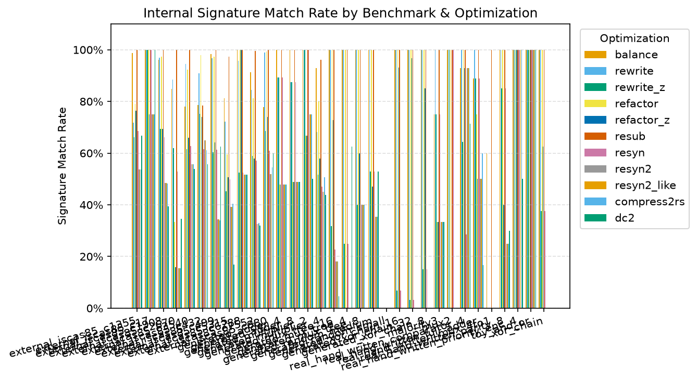
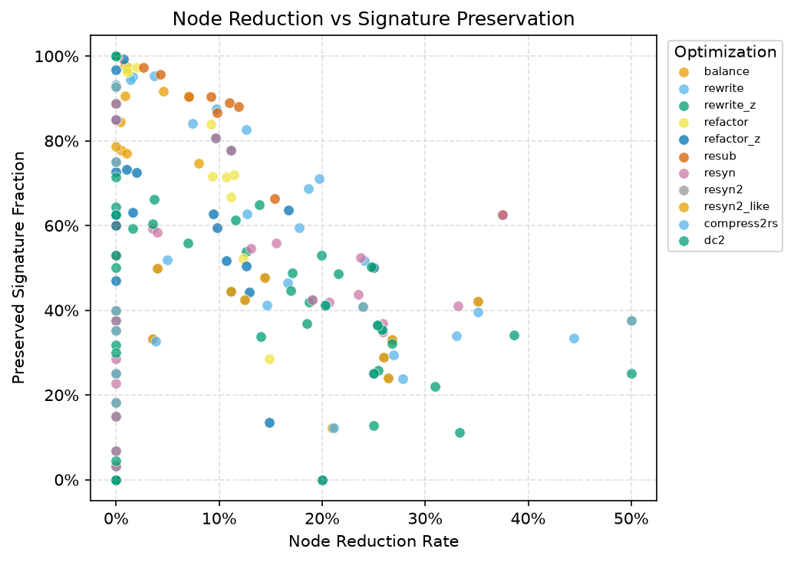
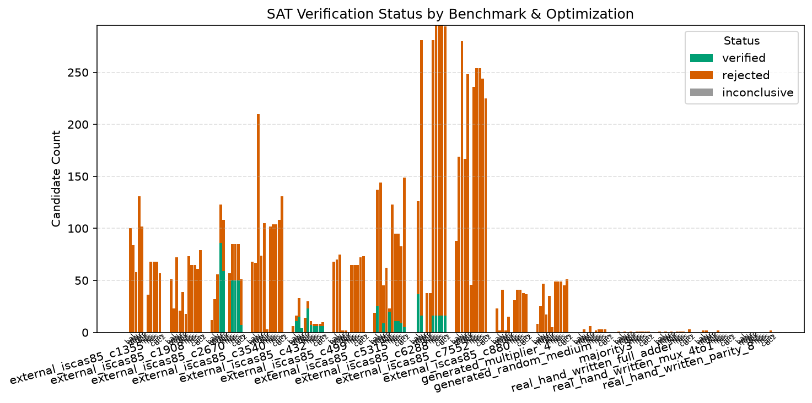
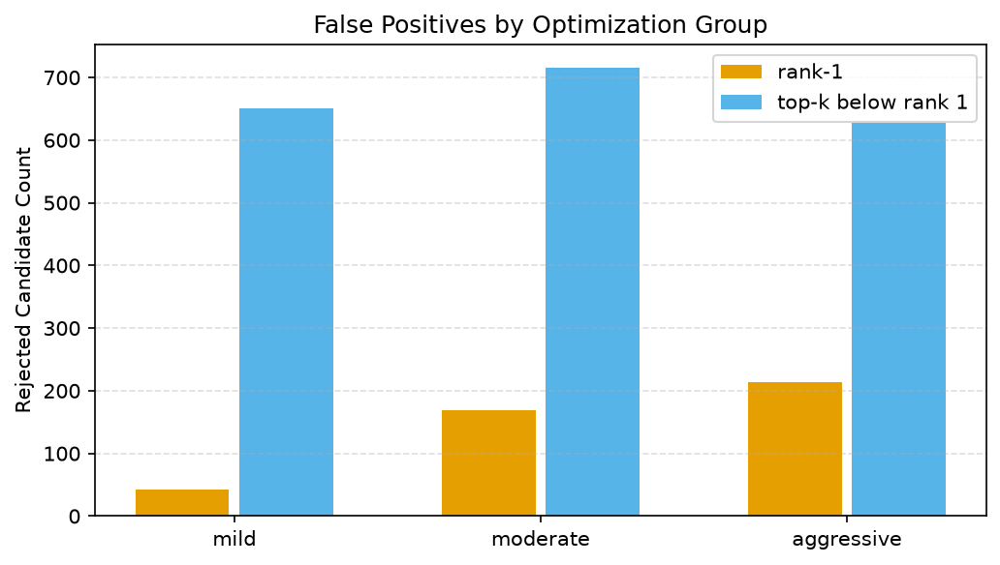
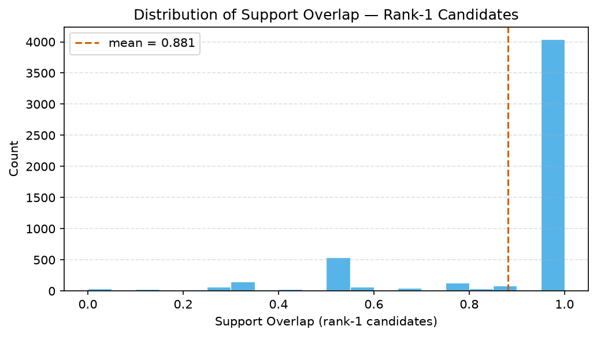

# AIG Optimization Correspondence Experiments

> **Status:** Research prototype — a small-scale study of how internal circuit nodes change
> under common logic synthesis optimizations, and how well we can still match them up afterwards.


---

## Table of Contents

1. [What is this project about?](#1-what-is-this-project-about)
2. [Background — circuits, gates, and optimization](#2-background--circuits-gates-and-optimization)
3. [Motivation](#3-motivation)
4. [Research question](#4-research-question)
5. [Benchmark circuits](#5-benchmark-circuits)
6. [Optimization flows](#6-optimization-flows)
7. [How the analysis works — step by step](#7-how-the-analysis-works--step-by-step)
8. [Metrics explained](#8-metrics-explained)
9. [Results](#9-results)
10. [SAT / formal equivalence refinement](#10-sat--formal-equivalence-refinement)
11. [Fingerprint recovery — top-K ranking](#11-fingerprint-recovery--top-k-ranking)
12. [Region-level matching](#12-region-level-matching)
13. [Ablation study](#13-ablation-study)
14. [CEGAR-style refinement](#14-cegar-style-refinement)
15. [Research plots](#15-research-plots)
16. [Current limitations](#16-current-limitations)
17. [How to run](#17-how-to-run)
18. [Repository structure](#18-repository-structure)
19. [ABC-native SAT sweeping / hybrid validation](#19-abc-native-sat-sweeping--hybrid-validation)
20. [Dependencies](#20-dependencies)

---

## 1. What is this project about?

Imagine you have a digital circuit — say, a chip that computes something — and you run it
through a tool that makes it smaller or faster (this is called **optimization** or **synthesis**).
The inputs and outputs of the circuit stay the same. But the internal wires and gates get
reorganized completely.

Now imagine you are a verification engineer and you want to compare the *before* circuit with
the *after* circuit. You want to know: "This wire here in the original — which wire in the
optimized circuit does the same job?"

That matching problem is called **node correspondence** or **internal signal correspondence**,
and it is surprisingly hard. This project measures how hard it is, tries several ways to
automatically recover correspondences, and tracks exactly where and why each approach
succeeds or fails.

---

## 2. Background — circuits, gates, and optimization

### What is a digital circuit?

A digital circuit is a network of **logic gates**. Each gate takes one or more binary inputs
(0 or 1) and produces one binary output. Common gates are AND (output is 1 only if all inputs
are 1), OR (output is 1 if at least one input is 1), and NOT (output is the opposite of the
input).

### What is a BLIF file?

**BLIF** stands for *Berkeley Logic Interchange Format*. It is a simple text format for
describing logic circuits. Each gate is described by a truth table (a list of input patterns
that produce output 1). Here is an example — the 3-input majority function (output is 1 when
at least two of three inputs are 1):

```
.model majority3
.inputs a b c
.outputs y

.names a b n_ab       ← AND gate: n_ab = a AND b
11 1

.names a c n_ac       ← AND gate: n_ac = a AND c
11 1

.names b c n_bc       ← AND gate: n_bc = b AND c
11 1

.names n_ab n_ac n_bc y   ← OR gate: y = n_ab OR n_ac OR n_bc
1-- 1
-1- 1
--1 1
```

The lines `n_ab`, `n_ac`, `n_bc` are the **internal nodes** — the intermediate wires that
exist only inside the circuit. They are not inputs or outputs. They are the things that change
when a synthesis tool restructures the circuit.

### What is an AIG?

**AIG** stands for *And-Inverter Graph*. It is a standard way to represent any logic circuit
using only AND gates and NOT (inversion) edges. Any BLIF circuit can be converted to AIG form.
AIG is the internal representation used by the ABC synthesis tool. When this project talks
about "nodes", it means nodes in the AIG.

### What is ABC?

**ABC** (from Berkeley) is a free, open-source tool for logic synthesis and verification. You
give it a circuit in BLIF format, ask it to optimize, and it produces an optimized BLIF. This
project uses ABC to generate the "before" and "after" circuits.

### What is synthesis optimization?

When ABC optimizes a circuit, it tries to reduce the number of gates (nodes) and the length of
the longest chain of gates (called **levels** or **depth**). Fewer nodes means a smaller chip.
Fewer levels means a faster chip (signals travel through fewer gates). The key point is that
the *external behavior* — what the circuit computes for every input combination — must not
change. Only the internal structure can change.

---

## 3. Motivation

Logic synthesis tools like ABC are very good at shrinking circuits. But they do not tell you
which internal node in the optimized circuit "came from" which internal node in the original.
That mapping — called a **correspondence** — is useful for:

- **Equivalence checking**: proving the optimized circuit computes the same function
- **Debugging**: if a bug is found in the optimized netlist, you need to find the corresponding
  line in the original RTL (Register Transfer Level) source
- **Coverage transfer**: verification tests written for the original may need to be translated
  for the optimized version
- **Technology mapping**: matching standard cell instances back to their logical origins

This project is a first, small-scale study asking: *can we find those correspondences
using simple heuristics, and does any formal verification step help?*

---

## 4. Research question

> After applying each of eleven ABC optimization flows (`balance`, `compress2rs`, `dc2`,
> `refactor`, `refactor_z`, `resub`, `resyn`, `resyn2`, `resyn2_like`, `rewrite`, `rewrite_z`)
> to a BLIF circuit, how many internal nodes can still be matched exactly?
> And when exact matching fails, does support/simulation overlap remain meaningful enough to
> recover useful candidate correspondences?

---

## 5. Benchmark circuits

### 5.1 Core toy circuits

The four hand-written toy benchmarks form the simplest test bed — small enough to inspect
by hand.

| Name | Inputs | Internal nodes | What it computes |
|---|---|---|---|
| `majority3` | a, b, c | 4 | Output is 1 when at least 2 of 3 inputs are 1 |
| `mux2` | sel, a, b | 2 | 2-to-1 multiplexer: output is a if sel=0, b if sel=1 |
| `toy_and_or` | a, b, c | 2 | Simple AND and OR combination |
| `xor_chain` | a, b, c, d | 8 | a XOR b XOR c XOR d (chain of XOR gates) |

### 5.2 Generated synthetic circuits

Twelve circuits are generated programmatically by `scripts/generate_synthetic_benchmarks.py`.
These cover adders, multipliers, MUX trees, XOR chains (8/16/32 bits) and random logic graphs
— giving a wider spread of node counts (8–92 nodes) and structural complexity.

| Family | Benchmarks |
|---|---|
| Adders | `generated_adder_4`, `generated_adder_8` |
| Multipliers | `generated_multiplier_2`, `generated_multiplier_4` |
| MUX trees | `generated_mux_tree_4`, `generated_mux_tree_8`, `generated_mux_tree_16` |
| Random logic | `generated_random_small`, `generated_random_medium` |
| XOR chains | `generated_xor_chain_8`, `generated_xor_chain_16`, `generated_xor_chain_32` |

### 5.3 Real hand-written circuits (`benchmarks/real/hand_written/`)

Five manually authored BLIFs, verified by simulation:

| File | What it computes | Internal nodes |
|---|---|---|
| `full_adder.blif` | 1-bit full adder (sum + carry) | 9 |
| `priority_enc_4.blif` | 4-to-2 priority encoder | 2 |
| `mux_4to1.blif` | 4-to-1 multiplexer | 10 |
| `comparator_4.blif` | 4-bit equality comparator | 14 |
| `parity_8.blif` | 8-bit XOR parity tree | 20 |

### 5.4 Verilog sources and ISCAS-85

`benchmarks/real/verilog_examples/` contains six Verilog modules (adder_8, popcount_8,
priority_encoder_8, comparator_8, alu_small, mux_tree_8). Convert with:
```bash
make real-benchmarks    # runs Yosys on all verilog_examples/ sources
```

ISCAS-85 / EPFL benchmarks must be imported locally — no results on those are published here.

---

## 6. Optimization flows

Each benchmark is passed through **eleven** ABC optimization sequences.

| Optimization | What it does | How aggressive |
|---|---|---|
| `balance` | Restructures the circuit to minimize the longest chain (depth/levels). | Mild |
| `rewrite` | Replaces sub-graphs with functionally equivalent ones from a pre-built database. | Mild–Moderate |
| `rewrite_z` | Zero-cost rewrite variant — accepts only reductions. | Mild–Moderate |
| `refactor` | Cuts out a small subgraph and replaces it with a simpler implementation. | Moderate |
| `refactor_z` | Zero-cost refactor variant — accepts only reductions. | Moderate |
| `resub` | Resubstitution: expresses one node's function in terms of other nodes already in the circuit, removing the original. | Moderate |
| `resyn` | Full resynthesis pass (balance + rewrite + refactor). | Moderate |
| `resyn2` | Two-pass resynthesis. | Moderate–Aggressive |
| `resyn2_like` | A sequence of multiple rewriting/balancing passes. A cascade of the above. | Aggressive |
| `compress2rs` | Aggressive compression using resubstitution + rewriting. | Aggressive |
| `dc2` | Don't-care-based rewriting — exploits unused input patterns. | Aggressive |

**Key insight:** mild optimizations tend to keep internal nodes intact. Aggressive
optimizations (especially `compress2rs`, `dc2`, `resyn2`, `resyn2_like`) can completely replace
every internal node with a new one that computes the same total output but through a totally
different intermediate structure.

---

## 7. How the analysis works — step by step

### Step 1 — Generate optimized variants

The script `run_abc_variants.sh` takes each benchmark BLIF, calls ABC with each optimization
command, and saves the result in `variants/`. After this step we have pairs like:
`variants/majority3_original.blif` and `variants/majority3_balance.blif`.

### Step 2 — Parse and simulate

`analyze_blif_matches.py` reads each pair. For every internal node in both circuits:

**a) Boolean signature (truth table)**

Feed every possible combination of primary inputs into the circuit and record what each
internal node outputs. For a circuit with 3 inputs there are 2³ = 8 combinations. The
sequence of 8 output bits (e.g. `00011101`) is the node's **signature**. Two nodes with
identical signatures compute the exact same Boolean function — they are a perfect match.

For circuits with many inputs (where exhaustive enumeration would be too slow), the tool uses
4096 random input patterns instead (**simulation mode: random** vs **simulation mode: exact**).
That distinction matters: in random mode, identical signatures are evidence on the sampled
patterns, not a formal truth-table proof.

**b) Support set**

The **support** of a node is the set of primary inputs that actually influence its output.
For example, `n_ab = a AND b` has support `{a, b}`. Support sets are compared using
**Jaccard similarity**:

```
Jaccard(A, B) = |A ∩ B| / |A ∪ B|
```

If two nodes depend on exactly the same inputs, Jaccard = 1.0. If they share no inputs,
Jaccard = 0.0.

**c) Logic depth**

The **depth** of a node is the length of the longest path from any primary input to that node,
measured in number of gates. Depth is normalized to [0, 1].

### Step 3 — Signature matching

Compare the signature multisets of original and optimized circuits. Every optimized node whose
signature appears in the original set is a **signature match**. If `is_formal_exact_mode = 1`,
this is a formal truth-table match because all input assignments were enumerated. If
`is_formal_exact_mode = 0`, it is only `signature_match_on_patterns`: a strong simulation
signal, but not a proof.

### Step 4 — Score and rank candidates

For nodes without an exact match, rank every original node as a **candidate**:

```
combined_score = 0.55 × simulation_similarity
               + 0.35 × support_overlap
               + 0.10 × depth_similarity
```

- **simulation_similarity**: how often the two nodes produce the same output on the same inputs
- **support_overlap**: Jaccard similarity of their support sets
- **depth_similarity**: 1 − |depth_A − depth_B| / max_depth

The weights (0.55 / 0.35 / 0.10) are a rough baseline — not tuned. The ablation study
(Section 13) tests whether different weights change the results.

---

## 8. Metrics explained

| Metric | Plain-English meaning |
|---|---|
| `original_nodes` | How many internal gates the original circuit had |
| `optimized_nodes` | How many internal gates after optimization |
| `original_levels` | Longest gate chain in the original (= circuit delay) |
| `optimized_levels` | Longest gate chain after optimization |
| `exact_internal_matches` | Backward-compatible count of matched signatures |
| `signature_match_on_patterns` | Number of optimized nodes whose signature matched on the evaluated patterns |
| `formal_truth_table_matches` | Number of matches that are formal truth-table matches; blank/0 when random simulation was used |
| `is_formal_exact_mode` | 1 if all input combinations were enumerated, 0 if random patterns were used |
| `pattern_count` | Number of input patterns used to build node signatures |
| `has_internal_nodes` | False for degenerate rows with no internal nodes; those rows are reported separately from preservation averages |
| `preserved_signature_fraction` | matched signatures / original internal nodes |
| `optimized_signature_coverage` | matched signatures / optimized internal nodes |
| `disappeared_fraction` | old signatures disappeared / original internal nodes |
| `novel_fraction` | new signatures appeared / optimized internal nodes |
| `old_signatures_disappeared` | Original nodes whose truth table no longer appears in the optimized circuit |
| `new_signatures_appeared` | Optimized nodes with truth tables that did not exist in the original |
| `avg_best_support_overlap` | Average Jaccard similarity between each optimized node's support and its best-matching original node's support |
| `simulation_mode` | `exact` = all 2^n input combinations tested; `random` = 4096 random patterns |
| `combined_score` | Weighted sum of simulation_similarity, support_overlap, depth_similarity |
| `rank` | Position in the candidate list (rank 1 = best match) |
| `verified` | SAT solver confirmed the two nodes are equivalent |
| `rejected` | SAT solver found a counterexample (they compute different functions!) |
| `inconclusive` | SAT check could not produce a verdict |
| `mrr` | Mean Reciprocal Rank — measures how high the correct match appears in the ranked list on average (1.0 = always at the top) |
| `rank1_consistency` | Fraction of nodes where the rank-1 candidate is the same across different scoring configurations |
| `region_score` | Similarity score computed for the whole cone of logic feeding into a node |
| `penalty` | CEGAR: score reduction applied to candidates resembling previously-rejected pairs |

---

## 9. Results

### 9.1 Key Results at a Glance

These five plots are the main experimental evidence for the current research story.

#### Signature Preservation by Optimization



This plot shows how often optimized internal-node signatures still appear in the original
circuit. Mild passes such as `resub`, `balance`, and `rewrite` preserve many signatures,
while aggressive flows such as `dc2`, `compress2rs`, and `resyn2_like` destroy much more
internal correspondence. This directly answers the core question: output-equivalent
optimization can still heavily disrupt internal-node matching.

#### Optimization Benefit vs Correspondence Loss



This plot compares node-count reduction with preserved signature fraction. It matters because
optimization quality and correspondence preservation are not the same objective: a pass can
reduce or restructure the circuit while also replacing internal functions that would have
served as correspondence anchors.

#### SAT Validation Status



This plot summarizes the rank-1 non-exact SAT validation layer. After fixing node exposure
with the shared `__cmp_out` output, ABC gives decisive verdicts instead of inconclusive
output-name failures. The important result is negative but useful: the selected rank-1
non-exact candidates are formally rejected, so they cannot be claimed as recovered
correspondences.

#### False Positives by Optimization Group



This plot groups formally rejected non-exact candidates by optimization aggressiveness. It
shows where the heuristic ranking creates plausible but wrong candidates. This supports the
methodological conclusion that simulation/support/depth scores are useful triage signals, but
formal SAT validation is required before claiming equivalence.

#### Support Overlap of Heuristic Candidates



This plot shows that many high-ranked candidates share very similar or identical input
support. That explains why the heuristic looks reasonable, but the SAT results show the limit:
same support does not imply same Boolean function. This is the strongest evidence that
structural locality and functional correspondence must be separated.

### 9.2 Detailed Signature Match Rate

**How to read this chart:** Each group of bars is one benchmark. Each bar is one optimization.
The height is `optimized_signature_coverage`: the fraction of optimized internal nodes whose
signature was also present in the original circuit. For rows with `simulation_mode = exact`,
this is a formal truth-table result. For rows with `simulation_mode = random`, it is only a
sampled-pattern result.

**What we see:**
- Most benchmarks + most optimizations → near 100% exact match. The optimizer restructured
  node names and positions but left the Boolean functions unchanged.
- The clear outlier is **`xor_chain` + `resyn2_like`** (and **`mux2` + `resyn2_like`**): 0%
  exact match. The aggressive multi-pass resynthesis replaced every single internal node with
  a functionally different intermediate.

### 9.3 Node and level counts

**How to read these charts:** Light bars = original circuit. Solid bars = optimized. You can
see whether the optimizer reduced the gate count and/or the logic depth.

**Full pipeline run:** 21 benchmarks × 11 optimization flows = **231 benchmark × optimization pairs** in `results/summary_metrics.csv`.
Of these, **220 rows have internal nodes** and **11 generated rows have zero internal nodes**;
the zero-internal-node rows are tracked with `has_internal_nodes = 0` and are not treated as
failed preservation cases.

**Results by benchmark family:**

| Family | Benchmarks | Avg orig nodes | Avg opt nodes | Avg optimized signature coverage | Avg preserved signature fraction |
|---|---|---|---|---|---|
| toy (majority3, mux2, toy_and_or, xor_chain) | 4 | 4.0 | 3.9 | 65.1% | 63.9% |
| real hand-written (full_adder, comparator_4, mux_4to1, parity_8, priority_enc_4) | 5 | 11.0 | 10.5 | 65.9% | 64.8% |
| generated (adders, multipliers, MUX trees, XOR chains, random) | 12 | 41.7 | 38.1 | 58.6% | 53.3% |

**Signature preservation by optimization** (averaged over rows with internal nodes):

| Optimization | Optimized signature coverage | Preserved signature fraction | Disappeared fraction | Novel fraction | Notes |
|---|---|---|---|---|---|
| `resub` | 99.8% | 97.5% | 2.5% | 0.2% | Best preservation; few novel optimized signatures |
| `balance` | 95.5% | 95.5% | 4.5% | 4.5% | Mostly preserves functions while changing structure |
| `rewrite` | 92.3% | 88.6% | 11.4% | 7.7% | Good preservation with moderate node reduction |
| `refactor` | 82.6% | 79.3% | 20.7% | 17.4% | More destructive than simple rewrite |
| `refactor_z` | 57.7% | 54.7% | 45.3% | 42.3% | Zero-cost does not mean correspondence-preserving |
| `rewrite_z` | 57.7% | 54.4% | 45.6% | 42.3% | Similar preservation loss to `refactor_z` |
| `resyn` | 55.2% | 51.8% | 48.2% | 44.8% | Multi-pass restructuring destroys many signatures |
| `compress2rs` | 36.4% | 30.7% | 69.3% | 63.6% | Aggressive compression, high signature churn |
| `resyn2` / `resyn2_like` | 35.6% | 31.2% | 68.8% | 64.4% | Cascade of rewrites; hard for internal matching |
| `dc2` | 30.6% | 26.8% | 73.2% | 69.4% | Lowest preservation; don't-care rewriting changes internal functions |

**Key insight:** mild flows (`resub`, `balance`, `rewrite`) preserve most internal signatures.
Aggressive flows (`compress2rs`, `dc2`, `resyn2_like`) create many disappeared and novel
signatures. This supports the central research claim that output equivalence does not imply
internal-node correspondence.

### 9.4 Support overlap distribution

Even when exact matching fails, the **support sets** of optimized nodes still largely overlap
with those of original nodes. The histogram shows the distribution of support overlap scores
for rank-1 candidates. Most values cluster near 1.0 — even after `resyn2_like` completely
replaces all truth tables, the new nodes still depend on the same primary inputs as some
original node.

**Key insight: signature matching is fragile, but support overlap is robust.**

---

## 10. SAT / formal equivalence refinement

### What is SAT and why do we need it?

**SAT** (satisfiability solving) is a technique for formally proving logical statements.
A **SAT-based equivalence checker** takes two logic circuits and either:
- **Proves** they always compute the same output for every possible input, or
- **Finds a counterexample** — a specific input where they differ.

This is also called **CEC** (Combinational Equivalence Checking).

Simulation alone can never *prove* equivalence — you can only check a finite number of inputs,
and there might always be a rare case that exposes a difference. A SAT-based check is a
**formal proof**.

ABC includes a CEC command (`cec`). This project uses it as a verification layer on top of the
simulation-based ranking.

### The pipeline

```
Simulation ranking
    ↓
Exact-match filter           (exclude is_exact_signature_match == 1)
    ↓
High-confidence filter       (combined_score ≥ 0.85, rank == 1)
    ↓
ABC equivalence check        (formal SAT-based CEC on non-exact candidates only)
    ↓
Verdict per candidate:
    verified      — proved equivalent
    rejected      — found a counterexample (different functions!)
    inconclusive  — ABC or BLIF preparation failed before a verdict
```

### Two distinct categories of candidate pairs

> **Methodological note:**
>
> The pipeline now separates candidates into two explicit categories stored in
> `match_category`:
>
> | Category | `is_exact_signature_match` | Meaning |
> |---|---|---|
> `exact_anchor` | 1 | Identical Boolean signature — already a confirmed match; ABC check is a sanity check only |
> `non_exact_candidate` | 0 | Signatures differ — SAT is doing **real work** trying to prove or disprove equivalence |
>
> By default (`INCLUDE_EXACT_ANCHORS = False` in `select_sat_candidates.py`), only
> `non_exact_candidate` rows are sent to ABC.

### How the ABC check works

For each high-confidence non-exact candidate pair (optimized node X, original candidate Y):
1. A temporary BLIF is created with X exposed through an artificial primary output named `__cmp_out`.
2. Another temporary BLIF is created with Y exposed through the same artificial output name.
3. ABC's `cec` command checks whether both produce the same output on every input.
4. The verdict is recorded.

Using the same artificial output name matters: the old implementation exposed each internal
node under its own node name, which made ABC reject many comparisons before solving because
the two BLIFs appeared to have different primary outputs.

This default CEC check is **same-polarity only**: it asks whether `f == g`. In AIGs, a useful
node correspondence can sometimes appear with inverted polarity. The separate complemented
validation layer below retests same-polarity rejections for `f == NOT g`; those results are
kept separate so the headline SAT numbers remain easy to interpret.

### SAT validation layers

The SAT validation is now split into three deliberately separate layers:

| Layer | Purpose | Verified | Rejected | Inconclusive | Interpretation |
|---|---:|---:|---:|---:|---|
| exact-anchor sanity | Check known preserved signature matches | 3,052 | 0 | 0 | The `__cmp_out` CEC wrapper accepts known-good correspondences |
| rank-1 non-exact recovery | Check best high-score non-exact candidate per optimized node | 0 | 425 | 0 | No recovered non-exact correspondence at rank 1 |
| top-k non-exact recovery | Check high-score non-exact candidates below rank 1, up to top 10 | 0 | 1,993 | 0 | No recovered non-exact correspondence appeared below rank 1 in this high-score pool |
| complemented non-exact follow-up | Retest same-polarity rejected non-exact candidates for `f == NOT g` | 0 | 2,418 | 0 | No complemented correspondence found in the selected rank-1/top-k non-exact pool |

These results are written to:

- `results/sat_exact_anchor_verified.csv`
- `results/sat_verified_candidates.csv`
- `results/sat_topk_nonexact_verified.csv`
- `results/sat_validation_layers.md`
- `results/sat_complement_summary.md`
- `results/sat_false_positive_analysis.csv`

### Rank-1 non-exact SAT result

**Candidates sent to ABC:** 425 (all `non_exact_candidate`; 3,052 `exact_anchor` rows excluded)

| Status | Count | % |
|---|---|---|
| Verified | 0 | 0.0% |
| Rejected | 425 | 100.0% |
| Inconclusive | 0 | 0.0% |
| **Total checked** | **425** | |

**How to read these numbers honestly:**

- **0 verified** — no non-exact candidate pair was formally proved equivalent by ABC.
  The simulation-based scoring assigns high scores to structurally similar nodes, but
  "structurally similar" does not mean "functionally equivalent" after aggressive
  multi-pass resynthesis. This is a genuine null result.

- **425 rejected** — simulation/support/depth scoring gave these pairs high scores
  (`combined_score` ranged from 0.851 to 0.996, mean 0.919), but ABC's formal check found
  counterexamples. **Simulation alone is not sufficient — formal verification catches real
  false positives.**

- **0 inconclusive** — after wrapping both exposed nodes with the same `__cmp_out` output,
  ABC can now give a formal verdict for every selected candidate.

The previous SAT run was **0 verified / 20 rejected / 405 inconclusive**. The new run is
**0 verified / 425 rejected / 0 inconclusive**. The fix did not uncover hidden recovered
correspondences; instead, it turned the old inconclusive cases into useful formal rejections.

> **What about exact anchors?** If you set `INCLUDE_EXACT_ANCHORS = True`, the 3,052 exact-match
> pairs are also run through ABC as a sanity check. In the current run, all **3,052 / 3,052**
> exact anchors verify. This confirms that the SAT pipeline accepts known preserved
> correspondences, but these rows do **not** count as recovered non-exact correspondences.

### Top-k non-exact SAT result

The next validation layer checks whether recovered equivalences appear below rank 1. The
selection used `rank > 1`, `rank <= 10`, `combined_score >= 0.85`, and
`is_exact_signature_match == 0`. In this dataset, all candidates meeting that threshold were
at ranks 2-5:

| Rank | Candidates |
|---:|---:|
| 2 | 650 |
| 3 | 549 |
| 4 | 432 |
| 5 | 362 |

ABC rejected all **1,993 / 1,993** of these below-rank-1 candidates. This means no formally
equivalent non-exact correspondence was found just below rank 1 in the high-score top-k pool.
It strengthens the negative result: the current heuristic produces plausible structural
neighbors, not recovered equivalences.

### Complemented-equivalence follow-up

Because AIGs naturally use complemented edges, the same-polarity result is not the whole
story. The follow-up script `sat_complement_refinement.py` retests same-polarity rejected
non-exact candidates by exposing the optimized node through an inverted `__cmp_out` buffer.
This checks whether the original candidate equals the complement of the optimized node.

| Layer | Same-polarity verified | Complemented verified | Rejected both polarities | Inconclusive |
|---|---:|---:|---:|---:|
| rank-1 non-exact recovery | 0 | 0 | 425 | 0 |
| top-k non-exact recovery | 0 | 0 | 1,993 | 0 |

So the current null result is not caused by missing simple inversions. The selected high-score
non-exact candidates are neither same-polarity equivalent nor complemented-equivalent as
global Boolean functions.

### False-positive analysis

The rejected non-exact candidates are not low-quality outliers. Many have high scores and
perfect support overlap:

- Rank-1 non-exact: 110 rejected candidates are in the `0.95-1.00` combined-score bucket.
- Top-k non-exact: 49 rejected below-rank-1 candidates are also in the `0.95-1.00` bucket.
- Rank-1 non-exact: 419 / 425 rejected candidates have `support_overlap = 1.00`.
- Top-k non-exact: 1,840 / 1,993 rejected candidates have `support_overlap = 1.00`.

So support equality is a useful locality signal, but it is not enough to imply functional
equivalence of internal nodes.

---

## 11. Fingerprint recovery — top-K ranking

### What does "recovery" mean?

After optimization, suppose you want to find which original node corresponds to optimized node
X. The ranking step produces a sorted list of candidates. **Score at rank 1** is the
confidence score of the top-ranked candidate — higher means the scoring formula is more
confident.

### Top-K recovery results

**How to read this chart:** Each bar is a benchmark. The height is the average `combined_score`
of the rank-1 candidate, averaged across all optimizations and nodes. Closer to 1.0 is better.

**What we see:** Most benchmarks achieve high rank-1 scores. Even in the hardest cases
(`xor_chain` variants, large generated XOR chains under `dc2`/`resyn2_like`) the rank-1
candidate still scores above 0.7, meaning the scoring formula finds the structurally closest
original node even when truth tables have completely changed.

**Top-K recovery across all 21 benchmarks:**

- **880 total** benchmark × optimization × K entries in `topk_recovery.csv`
- **0 / 880** have MRR > 0 — no non-exact candidate was SAT-verified in this run
- **K=1 node recovery**: 0 / 5,350 nodes recovered at rank 1 (**0.0%**)
- **Below-rank-1 high-score SAT recovery**: 0 / 1,993 verified (**0.0%**)

> **Note:** top-K recovery is computed using only `non_exact_candidate` verified pairs as
> ground truth (exact anchors are excluded). Since no non-exact candidate was verified by ABC
> in the current run, the recovery rate is 0. This is an honest result: the simulation-based
> scoring produces good structural rankings, but cannot prove functional equivalence for nodes
> whose truth tables differ after optimization.

---

## 12. Region-level matching

### What is a "region" in a circuit?

So far, we compared nodes one by one. But a single node's truth table can look identical to
another's by coincidence. A stronger test is to look at the **cone of logic** feeding into a
node — all the gates whose output eventually feeds into this node.

**Fanin cone at depth d** means: starting from the node, follow inputs backwards for d levels.
- Depth 1 = just the node's direct inputs
- Depth 2 = inputs of inputs
- Depth 3 = one more level back

If two nodes have similar cones of logic (similar structure, similar input sets, similar
functions), they are much more likely to be true correspondences.

### Cone similarity metrics

For each optimized node and each original candidate, the region score combines:

- **root_sim_score**: bit-similarity of the root node's simulation signature (the same
  global simulation used in `analyze_blif_matches.py` — it reflects the root's function,
  not a re-simulation of the isolated cone)
- **cone_support_jaccard**: Jaccard similarity of the full support sets of the two cones
- **cone_size_sim**: 1 − |size_A − size_B| / max_size (penalizes very different-sized cones)

### Region score results

**How to read this chart:** Each line is a benchmark. The x-axis is cone depth (1, 2, 3).
The y-axis is the average rank-1 region score. Higher is better.

**What we see:** Region scores are high (above 0.9) for all benchmarks at all depths, and
stay stable as depth increases. The fanin-cone approach confirms the same correspondences found
by single-node scoring — the matching is consistent at multiple scales.

---

## 13. Ablation study

### What is an ablation study?

An **ablation study** is an experiment where you remove or change one part of a system at a
time to see how much each part contributes. Here, we test six different weight settings for
the scoring formula:

```
combined_score = w_sim × simulation_similarity
               + w_sup × support_overlap
               + w_dep × depth_similarity
```

| Config | w_sim | w_sup | w_dep | Description |
|---|---|---|---|---|
| `baseline` | 0.55 | 0.35 | 0.10 | Default weights |
| `sim_heavy` | 0.80 | 0.15 | 0.05 | Trust simulation almost entirely |
| `sup_heavy` | 0.15 | 0.80 | 0.05 | Trust support overlap almost entirely |
| `equal` | 0.33 | 0.33 | 0.34 | Equal weights |
| `no_depth` | 0.60 | 0.40 | 0.00 | Ignore depth completely |
| `depth_only` | 0.00 | 0.00 | 1.00 | Use only depth (sanity check — should be bad) |

### Ablation results

**How to read this chart:** Each bar is a scoring config. The height is the average
`rank1_consistency` — the fraction of nodes where that config picks the same rank-1 candidate
as the baseline. A value of 1.0 = always picks the same top candidate.

**What we see:** Most configs have high rank1_consistency. The `depth_only` config drops
significantly — depth alone is not enough to recover correspondences. Simulation similarity
and support overlap together drive most of the useful signal.

---

## 14. CEGAR-style refinement

### What is CEGAR?

**CEGAR** stands for *Counterexample-Guided Abstraction Refinement*. It is a technique from
formal verification. The basic idea: when a verifier finds a counterexample (proof that two
things are NOT equivalent), use that counterexample to improve future predictions.

### How it works here

When ABC's formal check **rejects** a candidate pair, we record the **feature vector** of
that rejected pair:

```
feature_vector = [simulation_similarity, support_overlap, depth_similarity]
```

Then, for any future candidate whose feature vector is **similar** to a known rejected pair,
we apply a **penalty** to their score:

```
penalty = REJECTION_WEIGHT × max_similarity_to_any_rejected_pair

where:
  feature_similarity = 1 − (|Δsim| + |Δsup| + |Δdep|) / 3
  REJECTION_WEIGHT   = 0.20
```

In plain English: if a new candidate looks similar (in all three feature dimensions) to a
pair that was formally proved wrong, reduce its score by up to 20%. This is **learning from
mistakes**.

### Current status

This is labeled `[prototype]` because all 425 SAT-checked non-exact candidates were rejected,
so the current feedback signal is only negative. The penalty pass affects 2,117 candidate rows
and changes 173 rank-1 choices, but there are no verified non-exact positives yet to show that
the refined ranking improves true recovery.

---

## 15. Research plots

All ten plots are generated by running:

```bash
make research-plots
# or
python3 research_plots.py
```

They are saved to `results/plots/`.

The most important plots are embedded in Section 9.1. Additional generated plots are available
under `results/plots/`, including node/level reduction, top-k recovery, ablation comparison,
region scores, and per-benchmark node-count plots.

---

## 16. Current limitations

| Limitation | Details |
|---|---|
| **Small-scale benchmark coverage** | The full pipeline has been run across 21 benchmarks (4 toy, 5 real hand-written, 12 generated), ranging from 2 to 92 internal nodes. No results on large industrial circuits (ISCAS-85, EPFL, commercial netlists) are present — performance on those is unknown. |
| **BLIF only** | The parser handles `.names`-style gates only. RTL (Verilog/VHDL) is not supported. |
| **Simulation is not proof in random mode** | 55 of 231 summary rows use 4096 random patterns because exhaustive truth tables would be too large. Those rows support heuristic signature-matching claims, not formal truth-table claims. |
| **SAT candidate set is still filtered** | SAT now checks exact anchors, rank-1 high-confidence non-exact candidates, and high-score below-rank-1 top-k candidates. It still does not exhaustively check every non-exact pair in the full candidate table. |
| **Global equivalence is strict** | The SAT checks ask whether two internal nodes are globally equivalent for all primary-input assignments. After aggressive optimization, a node might still be useful under observability don't-care conditions even if it is not globally equivalent. Future work should validate ODC-aware correspondences or reuse ABC-native SAT sweeping/FRAIG equivalence classes. |
| **Weights are not tuned** | The 0.55 / 0.35 / 0.10 weights are a rough starting point — not learned from data. |
| **CEGAR has only negative labels** | The SAT stage now gives many useful rejections, but no verified non-exact positives. That is enough to learn false-positive patterns, not enough to evaluate recovery precision. |
| **Combinational circuits only** | No flip-flops, no clock. Sequential correspondence is a harder and separate problem. |
| **No RTL-to-netlist link** | The tool works at netlist level. Connecting back to original source-code variable names is future work. |

---

## 17. How to run

### Full research pipeline (one command)

```bash
make full-research-pipeline
```

This runs all steps in order: build ABC → generate variants → analyze → SAT → top-K →
ablation → region → CEGAR → research plots → tests.

### Individual steps

```bash
make build-abc           # clone and compile ABC (skip if abc is already on PATH)
make generate-variants   # create all BLIF variants via run_abc_variants.sh
make analyze             # simulate and rank (analyze_blif_matches.py)
make check-results       # warn if result CSVs were generated with an older schema
make plot                # legacy per-benchmark node-count plots
make sat-pipeline        # filter → ABC CEC → summary
make sat-validation-layers  # exact-anchor sanity + rank-1/top-k non-exact SAT checks
make sat-complement      # retest same-polarity rejections for complemented equivalence
make topk-eval           # top-K recovery metrics
make ablation            # ablation study (6 scoring configs)
make region              # region/fanin-cone correspondence
make cegar-refine        # CEGAR-style penalty pass
make research-plots      # generate all 10 research PNG plots
make real-benchmarks     # convert verilog_examples/ → BLIF via Yosys (prints warning if Yosys absent)
make generate-all-benchmarks  # synthetic + real benchmarks
make test                # run all 414 unit tests
```

### If ABC is not on your PATH

The Makefile's `build-abc` target clones and compiles ABC automatically. After building, the
binary is at `.abc_build/abc_repo/abc`. You can use it directly:

```bash
ABC=$(pwd)/.abc_build/abc_repo/abc make generate-variants
ABC=$(pwd)/.abc_build/abc_repo/abc make sat-pipeline
```

Or if you have ABC installed elsewhere:
```bash
ABC=/path/to/abc make generate-variants
```

### Run tests only

```bash
python3 -m pytest tests/ -v
```

For a quick check of the recent SAT/signature-metric changes:

```bash
python3 -m pytest tests/test_sat_refinement_abc.py tests/test_fingerprints.py -q
```

Expected for that focused check: **72 tests passing**.

Current full-suite result in this environment: **483 passed, 4 skipped**.

### Clean generated outputs (keeps benchmarks and scripts)

```bash
make clean-results
```

---

## 18. Repository structure

```
aig_optimization_experiments/
│
├── benchmarks/
│   ├── majority3.blif             3-input majority function
│   ├── mux2.blif                  2-to-1 multiplexer
│   ├── toy_and_or.blif            Simple AND/OR circuit
│   ├── xor_chain.blif             4-input XOR chain (hardest benchmark)
│   ├── real/                      Real-circuit benchmark suite
│   │   ├── hand_written/          Small BLIFs verified by hand
│   │   │   ├── full_adder.blif        1-bit full adder
│   │   │   ├── priority_enc_4.blif    4→2 priority encoder
│   │   │   ├── mux_4to1.blif          4-to-1 multiplexer
│   │   │   ├── comparator_4.blif      4-bit equality comparator
│   │   │   └── parity_8.blif          8-bit XOR parity tree
│   │   ├── verilog_examples/      Verilog sources (convert with Yosys)
│   │   │   ├── adder_8.v              8-bit ripple-carry adder
│   │   │   ├── popcount_8.v           8-bit population count
│   │   │   ├── priority_encoder_8.v   8-input priority encoder (3-bit grant + valid)
│   │   │   ├── comparator_8.v         8-bit magnitude comparator (lt/eq/gt)
│   │   │   ├── alu_small.v            4-bit ALU (ADD/SUB/AND/OR + zero flag)
│   │   │   └── mux_tree_8.v           8-to-1 balanced mux tree (3-level hierarchy)
│   │   └── README.md              Benchmark descriptions + conversion instructions
│   ├── generated/                 Synthetic BLIFs (make generate-benchmarks)
│   └── external/                  External suites — iteration 2 (place files here)
│       ├── iscas85/                  ISCAS-85 .blif files (not redistributed)
│       ├── epfl/                     EPFL .blif files (not redistributed)
│       └── README.md                 How to add / convert external benchmarks
│
├── variants/                      ABC-optimized BLIFs (generated, not committed)
├── logs/                          ABC stdout logs per run (generated)
│
├── results/
│   ├── summary_metrics.csv            Core metrics: nodes, levels, signature matches
│   ├── top_candidates.csv             Ranked candidates for every optimized node
│   ├── sat_refinement_candidates.csv  High-confidence candidates flagged for SAT check
│   ├── sat_verified_candidates.csv    ABC CEC verdicts per candidate
│   ├── sat_summary.csv                Summary counts and rates by benchmark/opt
│   ├── sat_summary.md                 Human-readable SAT report
│   ├── sat_exact_anchor_candidates.csv    Exact-anchor sanity-check candidates
│   ├── sat_exact_anchor_verified.csv      ABC CEC verdicts for exact anchors
│   ├── sat_topk_nonexact_candidates.csv   Below-rank-1 top-k non-exact candidates
│   ├── sat_topk_nonexact_verified.csv     ABC CEC verdicts for top-k non-exact candidates
│   ├── sat_validation_layers_summary.csv  Layered SAT result summary
│   ├── sat_complement_summary.csv         Complemented-equivalence SAT summary
│   ├── sat_complement_summary.md          Human-readable complemented SAT report
│   ├── sat_false_positive_analysis.csv    False-positive breakdown tables
│   ├── sat_validation_layers.md           Human-readable layered SAT report
│   ├── topk_recovery.csv              Top-K recovery metrics
│   ├── topk_recovery.md               Human-readable top-K report
│   ├── ablation_summary.csv           Ablation study results
│   ├── ablation_summary.md            Human-readable ablation report
│   ├── region_candidates.csv          Fanin-cone candidate scores (root_sim_score col)
│   ├── region_summary.csv             Per-depth region score summaries
│   ├── region_summary.md              Human-readable region report
│   ├── cegar_refined_candidates.csv   CEGAR-penalised candidate scores
│   ├── cegar_summary.md               Human-readable CEGAR report
│   ├── hybrid/                        ABC SAT sweep / hybrid validation outputs
│   │   ├── hybrid_validated_candidates.csv   Candidates annotated with ABC verdicts
│   │   ├── hybrid_validation_summary.md      Human-readable hybrid report
│   │   └── abc_sweep/                        Per-(benchmark, opt) ABC logs
│   │       └── <benchmark>/<opt>/
│   │           ├── dump_equiv.txt            Raw ABC equivalence classes
│   │           ├── dump_equiv.log            ABC stdout/stderr
│   │           └── fraig_stats.json          Before/after FRAIG node counts
│   └── plots/                         PNG plots (generated by research_plots.py)
│       ├── exact_match_rate.png
│       ├── support_overlap_dist.png
│       ├── node_reduction.png
│       ├── level_reduction.png
│       ├── sat_status.png
│       ├── topk_recovery.png
│       ├── ablation_comparison.png
│       ├── region_scores.png
│       ├── preservation_vs_reduction.png
│       └── false_positive_by_group.png
│
├── docs/
│   └── abc_sat_sweeping_extension.md  Design notes for the ABC hybrid validation flow
│
├── tests/                         pytest unit tests
│   ├── test_topk_recovery.py
│   ├── test_ablation_study.py
│   ├── test_region_correspondence.py
│   ├── test_cegar_refinement.py
│   ├── test_research_plots.py
│   ├── test_select_sat_candidates.py
│   ├── test_import_real_benchmarks.py
│   ├── test_benchmark_id.py
│   └── test_abc_sat_sweep.py          Tests for ABC SAT sweep / hybrid validation
│
├── scripts/
│   ├── generate_synthetic_benchmarks.py   Synthetic BLIF generator
│   ├── benchmark_id.py                    Collision-free benchmark ID from BLIF path
│   ├── import_real_benchmarks.py          Lists/imports real benchmarks; Yosys converter
│   └── abc_sat_sweep_validation.py        Core ABC dump_equiv / FRAIG module
│
├── analyze_blif_matches.py        Main analysis: parse BLIF, simulate, compare, rank
├── visualize_results.py           Legacy per-benchmark node-count plots
├── research_plots.py              Research-quality plots (10 PNGs)
├── select_sat_candidates.py       Filter: keeps rank-1 candidates with score ≥ 0.85
├── select_validation_candidates.py  Builds exact-anchor and top-k SAT candidate files
├── sat_refinement_abc.py          ABC CEC on filtered candidates
├── sat_complement_refinement.py   Complemented CEC follow-up for rejected non-exact candidates
├── summarize_sat_results.py       CSV + Markdown SAT summary
├── analyze_sat_validation_layers.py  Layered SAT + false-positive summaries
├── evaluate_topk_recovery.py      Top-K recovery metrics
├── ablation_study.py              Six scoring-weight configurations
├── region_correspondence.py       Fanin-cone region matching (root_sim_score)
├── counterexample_guided_refinement.py  CEGAR-style penalty pass
├── hybrid_validation.py           Top-level CLI: Python ranking + ABC dump_equiv
├── run_abc_variants.sh            Shell driver for ABC (discovers all benchmarks/**/*)
├── start.sh                       One-shot bootstrap script (classic pipeline)
├── Makefile                       All pipeline targets
└── requirements.txt               Python dependencies (pandas, matplotlib, pytest, tabulate)
```

---

## 19. ABC-native SAT sweeping / hybrid validation

### Motivation

The existing `sat_refinement_abc.py` script calls ABC's **combinational equivalence
checking (CEC)** command once per candidate pair — meaning one ABC subprocess per row in
`sat_refinement_candidates.csv`.  This is correct but inefficient: for a benchmark with
100 candidate pairs, ABC is launched 100 times.

### The `dump_equiv` approach

ABC's internal `dump_equiv` command does something more powerful: given two BLIF files, it
builds a combined miter AIG, runs **FRAIG** (simulation + SAT sweeping) on the merged
network, and writes out the resulting cross-network equivalence classes in one pass.

```
dump_equiv orig.blif opt.blif out.txt
```

Output format (one entry per line):
```
<class_id>:<model_name>:<node_name>
<class_id>:<model_name>:NOT:<node_name>   ← complement equivalence
```

Nodes in the same class are SAT-proven equivalent (or complement-equivalent).  The parser
in `scripts/abc_sat_sweep_validation.py` cross-references node name sets from each BLIF to
attribute every entry to either the original or optimised network, producing structured
`EquivPair` objects with a `confidence = "sat_proven"` tag.

### Efficiency comparison

| Approach | ABC calls per (bench, opt) pair | Provability | Simulation quality |
|---|---|---|---|
| `sat_refinement_abc.py` per-node CEC | One per candidate row | SAT (exact) | External Python |
| `hybrid_validation.py` dump_equiv | **One for the whole network pair** | SAT (exact) | ABC-internal FRAIG sims |

### How to run

```bash
# Quick way (uses the Makefile-built ABC)
make hybrid-validate

# Direct invocation
export ABC=.abc_build/abc_repo/abc
python3 hybrid_validation.py --top-k-validate 20 --min-score 0.70
```

Optional flags:

| Flag | Default | Description |
|---|---|---|
| `--abc-path PATH` | `$ABC` env var | Explicit ABC binary path |
| `--candidates PATH` | `results/top_candidates.csv` | Input candidates CSV |
| `--top-k-validate N` | 20 | Validate top-N candidates per (bench, opt) group |
| `--min-score F` | 0.70 | Skip rows with combined score below this threshold |
| `--output-dir DIR` | `results/hybrid/` | Where to write output files |

### Output files

| File | Description |
|---|---|
| `results/hybrid/hybrid_validated_candidates.csv` | Full annotated candidate table |
| `results/hybrid/hybrid_validation_summary.md` | Human-readable summary with counts table |
| `results/hybrid/abc_sweep/<bench>/<opt>/dump_equiv.txt` | Raw ABC equivalence file |
| `results/hybrid/abc_sweep/<bench>/<opt>/dump_equiv.log` | ABC stdout/stderr |
| `results/hybrid/abc_sweep/<bench>/<opt>/fraig_stats.json` | Before/after FRAIG node counts |

New columns added to the candidate table:

| Column | Values | Meaning |
|---|---|---|
| `abc_validated` | `True / False` | Node pair appears in a SAT-proven equiv class |
| `abc_complement` | `True / False` | Equivalence is complement (XOR = 1) |
| `abc_result` | `sat_proven_equivalent`, `sat_proven_complement`, `not_in_equiv_class`, `blif_not_found`, `abc_error` | Detailed outcome |
| `abc_log_file` | path string | Path to the ABC log for this (bench, opt) run |

### Implementation notes

- Core module: `scripts/abc_sat_sweep_validation.py` — can be imported independently
- Top-level CLI: `hybrid_validation.py`
- Design notes: `docs/abc_sat_sweeping_extension.md`
- `fraig_sweep` is not available in this ABC build; `fraig` (via `strash; fraig;
  print_stats`) is used instead for the single-network statistics
- If the ABC binary is missing, all `abc_*` columns are filled with safe defaults and a
  warning is printed; the Python ranking results are still written out

---

## 20. Dependencies

### Python packages

```bash
pip install -r requirements.txt
```

`requirements.txt` contains: `pandas`, `matplotlib`, `pytest`, and `tabulate` (used by
Markdown summary tables).

### Berkeley ABC

ABC is a C tool that must be compiled. The Makefile handles this automatically:

```bash
make build-abc
```

This clones [https://github.com/berkeley-abc/abc](https://github.com/berkeley-abc/abc) into
`.abc_build/abc_repo/` and runs `make`. The resulting binary is at `.abc_build/abc_repo/abc`.

If you already have ABC installed:

```bash
export ABC=/path/to/your/abc
```

### Python version

Tested with Python 3.13. Should work with Python 3.9+.

---

## 21. Research Iteration 2: External Benchmarks

Iteration 1 (everything above) established the methodology and result story on
**21 benchmarks**: 4 toy, 12 generated/synthetic, and 5 custom hand-written
circuits. Those results are **final and unchanged** — this iteration only
*adds* the ability to re-run the same analysis on realistic external suites.

### Why external benchmarks are needed

Toy and synthetic circuits are useful for controlled experiments, but they do
not reflect the structure of circuits that synthesis tools are tuned for. To
strengthen experimental validity we add first-class support for two standard,
widely-cited combinational benchmark families:

- **ISCAS-85** — classic gate-level combinational circuits (c17, c432, …).
- **EPFL** — the EPFL combinational benchmark suite (adder, bar, max, …).

This lets us check whether the Iteration 1 findings — simple passes preserve
internal signatures, aggressive resynthesis destroys them, non-exact candidates
are structurally similar but functionally different — also hold on realistic
circuit families.

### Source families

Every benchmark is tagged with a **source family**, inferred purely from its
path by `scripts/benchmark_id.py::infer_source_family`:

| source family | where the files live                       |
|---------------|--------------------------------------------|
| `toy`         | `benchmarks/*.blif`                         |
| `generated`   | `benchmarks/generated/*.blif`               |
| `custom`      | `benchmarks/real/**/*.blif`                 |
| `iscas85`     | `benchmarks/external/iscas85/*.blif`        |
| `epfl`        | `benchmarks/external/epfl/*.blif`           |

The `summary_metrics.csv` now carries a `source_family` column, and a new
`results/benchmark_manifest.csv` describes every benchmark file present.

### Where to place ISCAS-85 / EPFL files

The external suites are **not redistributed here** and are **never downloaded
automatically**. Place the files yourself:

```
benchmarks/external/
├── iscas85/   # drop c17.blif, c432.blif, … here
└── epfl/      # drop adder.blif, bar.blif, … here
```

See `benchmarks/external/README.md` for sources. If you only have AIGER
(`.aig`, `.aag`, `.aiger`) or Verilog/SystemVerilog (`.v`, `.sv`), convert them
with the documented helper (uses ABC / Yosys — no network access). The
`--input-dir` may be a suite root; files are discovered recursively, while
hidden/cache directories are skipped:

```bash
# List what is present
python3 scripts/import_external_benchmarks.py --list

# Import BLIF files you already have locally
python3 scripts/import_external_benchmarks.py --family iscas85 \
    --input-dir /path/to/iscas85_blifs/

# Import + convert AIGER (EPFL suite) via ABC
python3 scripts/import_external_benchmarks.py --family epfl \
    --input-dir /path/to/epfl/ --convert-aiger

# Import + convert Verilog/SystemVerilog via Yosys
python3 scripts/import_external_benchmarks.py --family epfl \
    --input-dir /path/to/verilog_or_sv_root/ --convert-verilog
```

ABC conversion command used under the hood:

```
abc -c "read_aiger <in>.aig; strash; write_blif <out>.blif"
```

### How to run the pipeline

Discovery is automatic — `run_abc_variants.sh` recursively finds
`benchmarks/**/*.blif`, including `benchmarks/external/`. Nothing else needs to
change:

```bash
# 1. record what benchmarks are present (toy/generated/custom/iscas85/epfl)
make benchmark-manifest          # → results/benchmark_manifest.csv

# 2. run the analysis + plots (works with or without external benchmarks)
make generate-variants analyze sat-pipeline research-plots
```

If `benchmarks/external/iscas85/` and `benchmarks/external/epfl/` are empty, the
pipeline runs normally on the existing 21 benchmarks and prints a clear warning
that no external benchmarks were found.

### New plots and tables

- `results/benchmark_manifest.csv` — one row per benchmark file: source family,
  path, #inputs / #outputs / #internal nodes, whether exact truth-table mode is
  possible, and notes.
- `results/plots/preservation_by_pass_and_family.png` — mean preserved signature
  fraction per optimization pass, grouped by source family.
- `results/plots/reduction_vs_preservation_by_family.png` — node reduction vs
  preservation, coloured by source family.
- `results/plots/sat_validation_by_family.png` — SAT verified / rejected /
  inconclusive totals per source family.
- `results/plots/mild_vs_aggressive_external.png` — mild vs aggressive
  optimization on external suites only. **This plot is intentionally skipped
  until ISCAS-85 / EPFL files are present** (it would otherwise have no data).

### How to interpret external results

Once external benchmarks are added, compare the per-family bars against the
toy/generated baselines:

- If `iscas85` / `epfl` show the **same** preservation-vs-pass shape as
  generated circuits, the Iteration 1 conclusions generalize.
- If aggressive passes destroy *more* signatures on external circuits, it
  indicates the synthetic benchmarks were easier than realistic ones.
- The `sat_validation_by_family` bars show whether the non-exact null result
  (structurally similar ≠ functionally equivalent) holds on realistic circuits.

### ISCAS-85 Results

**Current status:** no real ISCAS-85 benchmark files are present in this
checkout. The local folders were checked and `benchmarks/external/iscas85/`
currently contains only its README placeholder, so this repository does **not**
claim ISCAS-85 preservation, SAT, or optimization results yet.

When ISCAS-85 files are available, place or import the small circuits first:

```
c17  c432  c499  c880  c1355  c1908
```

Supported source formats and workflows:

```bash
# Already-converted BLIF files: copied recursively into the ISCAS folder
make import-external FAMILY=iscas85 INPUT_DIR=/path/to/iscas85_blif_root

# Original ISCAS .bench files: converted through ABC read_bench → BLIF
make import-external FAMILY=iscas85 INPUT_DIR=/path/to/iscas85_bench_root \
    ARGS=--convert-bench

# Verilog/SystemVerilog files: converted through Yosys
make import-external FAMILY=iscas85 INPUT_DIR=/path/to/iscas85_hdl_root \
    ARGS=--convert-verilog

# AIGER files: converted through ABC read_aiger → BLIF
make import-external FAMILY=iscas85 INPUT_DIR=/path/to/iscas85_aiger_root \
    ARGS=--convert-aiger
```

After import, run:

```bash
make benchmark-manifest
make list-external
make generate-variants
make analyze
make sat-pipeline
make research-plots
make check-results
```

The ISCAS rows will be tagged as `source_family = iscas85`, so they stay
separate from `toy`, `generated`, and `custom` results in the CSVs and
family-separated plots. The key questions to answer after real files are added
are whether mild passes still preserve most internal signatures, whether
aggressive passes still destroy correspondences, and whether SAT validation
continues to reject high-score non-exact candidates.

> **Status:** as committed, `benchmarks/external/iscas85/` and
> `benchmarks/external/epfl/` contain only `README.md` placeholders — **no
> external benchmark files were available**, so **no ISCAS-85 / EPFL results are
> claimed**. The manifest, importer, discovery, and family-separated plots are
> in place and verified on the existing 21 benchmarks; adding files under
> `benchmarks/external/` is all that is required to produce external results.

---

## Short research summary

> This prototype works at the BLIF/AIG level and measures how synthesis optimizations affect
> internal node correspondence. The full pipeline was run across **21 benchmarks** (4 toy,
> 5 real hand-written, 12 generated — ranging from 2 to 92 internal nodes) × **11 ABC
> optimization flows** = 231 benchmark × optimization pairs. The key findings:
>
> - **Simple optimizations** (`resub`, `balance`, `rewrite`) preserve most internal
>   signatures. Average optimized signature coverage is 99.8%, 95.5%, and 92.3% respectively.
> - **Aggressive resynthesis** (`compress2rs`, `dc2`, `resyn2`, `resyn2_like`) drops optimized
>   signature coverage to roughly 30–36% on average, with high disappeared/novel-signature
>   fractions.
> - **Support overlap** survives even when truth tables change — it is a robust signal.
> - The **simulation + support + depth scoring formula** gives high-scoring structural
>   candidates, but the current SAT run does not verify any non-exact candidates. It should be
>   treated as a prioritization heuristic, not as recovered equivalence.
> - **SAT refinement** now has a clean sanity layer: **3,052 / 3,052 exact anchors verify**,
>   so the `__cmp_out` CEC wrapper accepts known preserved correspondences.
> - **Non-exact SAT recovery remains a null result**: rank-1 candidates are
>   **0 verified / 425 rejected / 0 inconclusive**, and high-score below-rank-1 top-k
>   candidates are **0 verified / 1,993 rejected / 0 inconclusive**. The selected
>   non-exact candidates are structurally similar but functionally different.
> - **Complemented-equivalence validation also rejects the selected non-exact pool**:
>   **0 complemented verified / 2,418 rejected / 0 inconclusive** across rank-1 and top-k
>   same-polarity rejections. The null result is therefore not just a missing-inverter issue.
> - The current SAT result is a global internal-node equivalence result. ODC-aware matching
>   and ABC-native SAT sweeping/FRAIG equivalence classes are the next step if the goal is to
>   recover correspondences that are only valid in circuit context.
> - The **newer hybrid `dump_equiv` flow** reuses ABC's internal SAT sweeping / FRAIG
>   machinery and validates all candidates in one ABC call per benchmark–optimization pair,
>   making it a more scalable follow-up to the original per-candidate CEC approach.
> - **Region-level, ablation, and CEGAR analyses** confirm these findings from multiple angles
>   and provide a foundation for future work on larger, real-world circuits.
