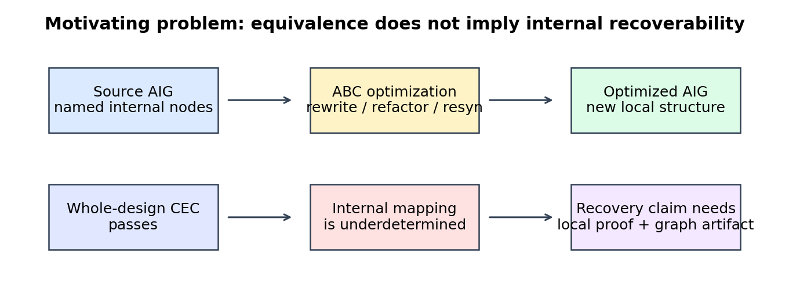
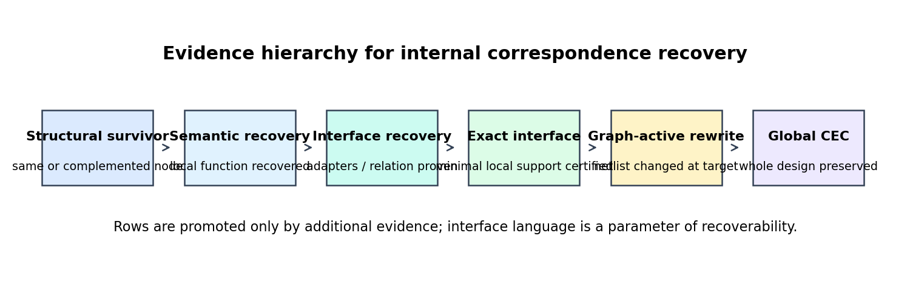
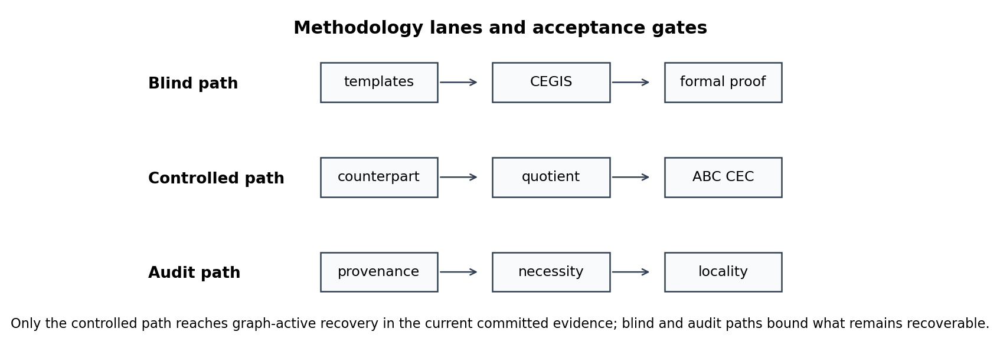
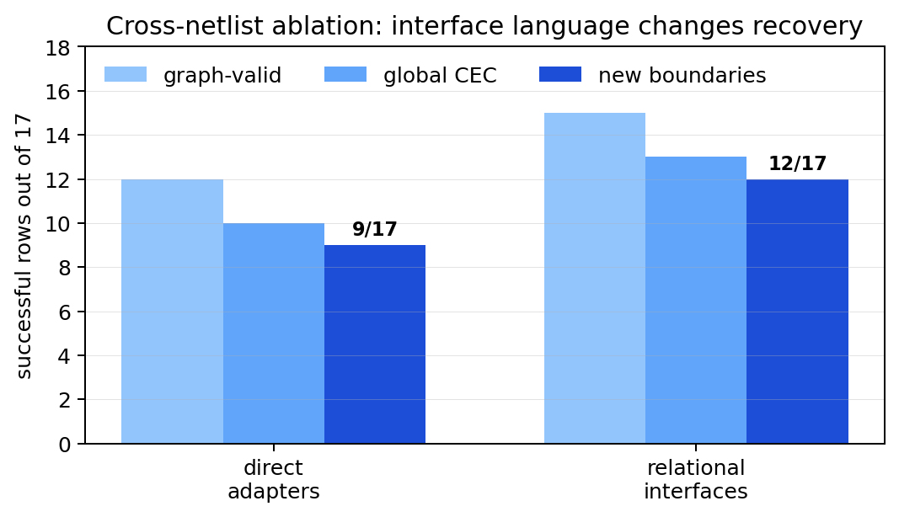
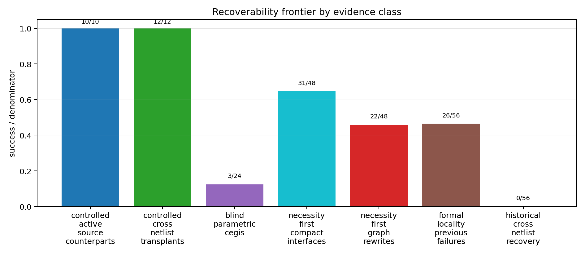
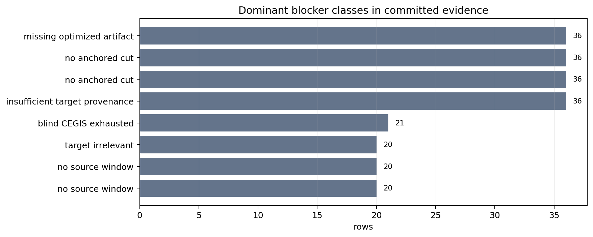
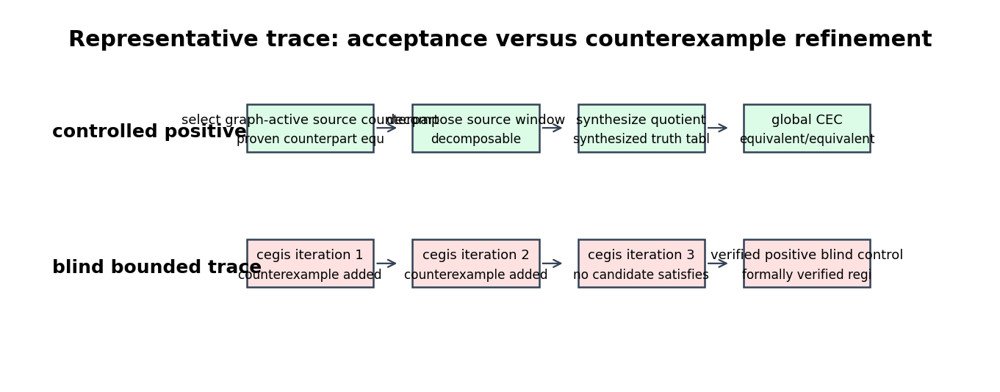

# Abstract

Logic synthesis preserves input-output behavior while deliberately changing the
internal implementation. This makes a simple question surprisingly hard: after
an And-Inverter Graph (AIG) has been optimized, when can a reviewer trust that
an internal source expression, boundary, or cut has been recovered in the
optimized netlist? This paper presents a research artifact that treats internal
correspondence as a hierarchy of evidence rather than a single yes/no result.
The artifact separates structural survival, semantic region recognition, exact
locality certificates, graph-active rewriting, and global equivalence checking;
it also keeps controlled, blind, oracle, generated, historical, and diagnostic
denominators separate. The main empirical result is a recoverability frontier:
controlled source-side counterparts and cross-netlist transplants reach
global-CEC-backed graph-active recovery on their positive generated cases
(10/10 and 12/12), while blind bounded semantic CEGIS recovers 3/24 regions,
necessity-first generated targets expose 31/48 compact exact input interfaces
and now emit 31/48 valid rewrite artifacts, of which 22/48 are graph-active
CEC-backed new boundaries after bounded fanout-frontier expansion. Corrected historical diagnostic rows still support
0/56 graph-active recoveries. Within the controlled cross-netlist
experiment, relational interfaces also expand accepted graph-active recovery
from 9/17 direct-adapter rows to 12/17 relational-interface-enabled rows,
showing that the boundary language itself can change recoverability. The
negative results are not incidental: they are replayable blocker certificates
for missing provenance, target irrelevance, non-compact locality, and absent
rewrite artifacts. A new evidence-advancement layer records exactly which
future-work rows move up in evidence level today: 0/56 source-blind rows reach
graph-active recovery, 22/48 necessity-first rows become graph-active
CEC-backed new boundaries under the bounded truth-table rewrite language, 4/12
operator/mode CEGIS groups are complete for their attempted rows, 3/3 tiny CC0
RTL designs are pinned but not lowered locally because Yosys is unavailable,
0/10 contextual ODC anchors reach graph-active placement, and 57/57 locality
certificates have JSON proof objects. The repository therefore contributes an
auditable framework for making internal-correspondence claims after logic
optimization without mixing evidence levels or denominators.

# 1. Introduction

Modern logic synthesis is effective because it is not loyal to the internal
structure of the source design. A synthesis flow can balance paths, rewrite AIG
subgraphs, resubstitute nodes, exploit don't-care freedom, and then prove that
the transformed circuit is equivalent to the original. For ordinary synthesis
quality this is exactly the point. For debug, explanation, proof-carrying
transformations, incremental ECO-style reasoning, source mapping, and
optimization accountability, the same behavior is a problem. Whole-design
equivalence says that the primary outputs agree; it does not say where a
particular source-level computation survived, whether a recovered optimized
node is useful at a local boundary, or whether replacing it would preserve the
design.

This artifact studies that gap for AIG optimization experiments. The initial
temptation was to look for a large internal recovery count: compare source and
optimized nodes, rank candidates by structural and simulation similarity, and
ask how many can be validated. The committed evidence shows that this framing
is too coarse. Exact anchors are useful sanity checks, but non-exact structural
candidates collapse under ABC equivalence checking. Semantic expression proofs
can recognize isolated functionality, but isolated recognition does not imply a
legal graph rewrite. Exact minimum locality certificates can prove that a
compact interface exists, but an exact interface is still not a recovered
boundary unless a graph-active artifact is emitted and the full circuit remains
equivalent.

The central thesis is therefore:

> Internal correspondence after AIG optimization has a recoverability frontier:
> structural similarity, semantic recognition, exact locality, graph activity,
> and global equivalence form distinct evidence levels, and serious claims must
> report where each denominator stops.

Figure 1 summarizes the motivating distinction. A synthesized design may pass
whole-design CEC even when internal nodes no longer have a direct counterpart.
The artifact asks which additional evidence promotes a candidate from a
similar-looking internal signal to a recovered, graph-active correspondence.



The contribution is not a new synthesis optimizer. It is a disciplined
experimental framework for internal-correspondence recovery. Its novelty is in
the way it combines proof obligations, failure accounting, and artifact
validation:

1. **A recoverability evidence hierarchy.** The artifact defines and enforces
   separate levels for structural survival, semantic region recovery, exact
   locality certificates, graph-active rewrite artifacts, and global CEC.
2. **Constructive controlled recovery paths.** Source-side counterparts and
   cross-netlist transplants are accepted only after local proof, quotient or
   adapter construction, graph activity, and whole-design CEC. The committed
   controlled positives reach 10/10 and 12/12 accepted recoveries,
   respectively.
3. **Interface abstraction as a recovery parameter.** Cross-netlist
   transplantation shows that recoverability depends on the allowed boundary
   language, not only on node semantics: direct adapters recover 9/17 controlled
   new boundaries, while relational-interface-enabled transplantation recovers
   12/17 under the same controlled denominator.
4. **Blind and oracle separation.** Blind bounded CEGIS, Z3-backed diagnostic
   CEGIS, oracle-bus rows, and oracle-window decomposition rows are reported as
   different evidence classes. Blind recovery is 3/24 in the primary
   parametric-CEGIS table, while the larger Z3 experiment is reported as a
   separate solver-scalability diagnostic.
5. **Compact-locality-to-rewrite promotion.** The necessity-first path now
   converts compact exact interfaces into concrete BLIF rewrite artifacts under
   a bounded truth-table rewrite language. It emits 31 valid artifacts; a
   bounded fanout-frontier expansion stage promotes four additional compact
   rows, yielding 22 graph-active CEC-backed new boundaries. The remaining nine
   emitted artifacts remain valid but are classified as identical-driver
   rewrites rather than constructive boundary recovery.
6. **Negative results as certificates.** Historical and generated failures are
   not treated as uninformative misses. They are classified by replayable
   blockers: missing optimized artifacts, target irrelevance after
   reconstruction, non-compact exact interfaces, no globally anchored cut, and
   non-active rewrite artifacts.
7. **A reviewer-oriented artifact contract.** Stable Make targets build paper
   tables and figures from committed CSVs, validate row-count freshness, run
   portable no-ABC checks, run ABC-backed checks when available, and compile
   this paper into a PDF.
8. **Evidence advancement without count inflation.** The repository includes a
   checked next-step layer that pins a redistributable RTL seed corpus, emits
   machine-checkable locality proof objects, and records which source-blind,
   compact-interface, CEGIS, and ODC rows still lack the obligations needed for
   graph-active claims.

# 2. Background and Related Work

The artifact is built around AIGs, ABC, SAT/SMT equivalence checking, and
functional decomposition. AIGs are a compact Boolean circuit representation
using two-input AND nodes and complemented edges; the AIGER format documents a
portable file representation for such graphs [@biere_aiger_2007]. ABC is the
reference implementation used in this artifact for AIG optimization and
combinational equivalence checking; the ABC paper describes it as a synthesis
and formal-verification system based on scalable AIG transformations
[@brayton_abc_2010].

The optimization flows studied here are directly related to DAG-aware AIG
rewriting, balancing, refactoring, resubstitution, and don't-care based
resynthesis. DAG-aware AIG rewriting reduces area by considering alternative
subgraphs in a shared DAG, rather than optimizing each local expression in
isolation [@mishchenko_dag_aware_2006]. FRAIGs integrate simulation and SAT
reasoning to merge functionally equivalent AIG nodes and provide a common
representation for synthesis and verification [@mishchenko_fraigs_2005].
Don't-care based resynthesis further changes internal implementation by using
local flexibilities and SAT-based care computation to justify replacements
[@mishchenko_dont_care_2011]. These methods are designed to improve circuits,
not to preserve debug-friendly internal identity.

The artifact's proof obligations are aligned with equivalence-checking
practice but applied to internal correspondence claims. Whole-design CEC asks
whether the primary outputs of two designs are equivalent. Internal
correspondence recovery asks for more: a candidate region, interface, or
replacement must be locally well-defined and globally harmless. ABC supplies
the CEC backend for netlist-level acceptance, while Z3 supplies bit-vector SMT
proofs for the semantic CEGIS path [@de_moura_z3_2008].

Counterexample-guided inductive synthesis is the closest methodological
relative for the blind semantic path. The classic sketching work uses a
candidate-generation and verification loop over finite programs
[@solar_lezama_sketching_2006]. Here, the same pattern is adapted to bounded
hardware-region templates: propose a candidate expression from examples, prove
or refute it against the region truth table or SMT formula, and add a concrete
counterexample when it fails.

Functional decomposition provides the conceptual basis for quotient-style
refactoring. Ashenhurst decomposition and Curtis's later formulation study
whether a Boolean function can be expressed through intermediate subfunctions
over smaller variable sets [@ashenhurst_decomposition_1957; @curtis_switching_1962].
The artifact uses this idea operationally: a recovered semantic divisor is not
useful until the remaining source or target window admits an exact quotient and
the resulting graph edit survives global CEC.

Benchmarks include generated BLIF families and ISCAS-85-style netlists. The
ISCAS-85 circuits remain a common combinational benchmark reference
[@brglez_iscas85_1985], but this artifact is careful not to treat every legacy
or historical result row as a valid denominator. A row is a valid denominator
only when its source artifact, optimized artifact, target, interface, proof
scope, and checker contract are reconstructible.

# 3. Problem Formulation

Let $G_s = (V_s,E_s)$ be the source AIG and $G_o = (V_o,E_o)$ the optimized
AIG produced by a synthesis flow. Both graphs have primary inputs $I$ and
primary outputs $O$. A conventional equivalence check proves
$$
  \forall i \in \{0,1\}^{|I|}. \; G_s(i)|_O = G_o(i)|_O .
$$
This relation is necessary for any graph rewrite accepted by the artifact, but
it is not sufficient for internal correspondence.

An **internal correspondence candidate** is a tuple
$$
  c = (S, T, B_i, B_o, \phi, e)
$$
where $S$ is a source-side expression or region, $T$ is an optimized-side
target or region, $B_i$ and $B_o$ are input and output boundary interfaces,
$\phi$ is an optional adapter or quotient, and $e$ records the evidence
level. Candidates may be source-blind, oracle-assisted, or controlled:

- **Source-blind** candidates may use optimized graph structure, simulation,
  CEGIS examples, and public benchmark metadata, but not the hidden ground
  truth expression at inference time.
- **Oracle** candidates may use selected ground truth to diagnose whether a
  failure is due to interface discovery, factorization, or implementation.
- **Controlled** candidates are generated with known source counterparts and
  are used to test whether the proof and rewrite machinery can accept valid
  positives and reject invalid controls.
- **Historical diagnostic** candidates are previous rows whose provenance is
  audited after the fact; they are not automatically eligible recovery
  attempts.

The artifact defines six evidence levels, shown in Figure 2. The cross-netlist
ablation motivates the extra interface level: a recovered semantic function is
not necessarily recoverable through a particular boundary language.



**Structural survival.** A node is structurally recovered when a same-polarity
or complemented candidate is validated against a source node under the chosen
scope. This is a useful sanity layer but does not establish that a source-level
boundary can be rewritten.

**Semantic region recovery.** A region is semantically recovered when a
candidate expression is formally equivalent to the region function under the
declared interface. This level supports recognition claims.

**Interface recoverability.** A candidate is interface-recoverable when the
semantic region can be connected to the surrounding source and optimized
context using an admissible adapter language. This level is stricter than
semantic recognition and weaker than graph-active rewriting.

**Exact locality.** A candidate has an exact local interface when the artifact
proves a lower bound and matching upper bound for the required boundary within
the declared universe. This level supports locality claims, not graph-rewrite
claims.

**Graph-active recovery.** A graph rewrite is graph-active when it changes the
netlist at the target rather than reintroducing an identity or dead artifact.
The artifact does not count local proofs or materialized diagnostic wires as
graph-active recoveries unless a concrete rewrite artifact is emitted.

**Global CEC-backed recovery.** A graph-active rewrite is accepted only when
ABC proves the full source/optimized or cross-netlist design equivalent after
the edit.

For clarity, the paper uses $R_L(t)$ for the recoverability of target $t$ under
an admissible interface language $L$. Here $L_{direct}$ permits direct exact
adapters over the declared boundary variables, while $L_{rel}$ additionally
permits the controlled relational-interface path recorded by the latent
interface tables. In the 17-case controlled cross-netlist ablation,
$R_{L_{direct}}$ accepts 9 targets and $R_{L_{rel}}$ accepts 12. This is a
language-parameterized frontier, not a universal claim about all possible
interface formalisms.

The research questions follow from the hierarchy:

**RQ1.** How quickly do structural internal correspondences erode under common
AIG optimization flows?

**RQ2.** How far can blind bounded semantic CEGIS recover internal region
semantics without oracle access?

**RQ3.** When a source-side semantic counterpart is known or constructible, can
the artifact turn it into graph-active CEC-backed recovery?

**RQ4.** Can cross-netlist adapters move controlled correspondences between
optimized designs, and does the allowed interface language change the
recoverable set?

**RQ5.** What do the null results say about locality, provenance, and target
necessity in generated and historical rows?

# 4. Framework

The implementation is organized as three methodology lanes and one shared
acceptance discipline (Figure 3). The blind lane estimates what can be inferred
without privileged source expressions. The controlled lane checks whether valid
semantic correspondences can be turned into graph-active edits. The audit lane
explains why rows from earlier experiments should or should not count as
eligible denominators.



The shared acceptance discipline is deliberately strict:

1. Build or load the source and optimized BLIF/AIG artifacts.
2. Identify a candidate target and boundary universe.
3. Prove the local semantic relation, or record a concrete counterexample.
4. If the claim is a rewrite claim, emit a concrete graph artifact and show
   that the artifact changes the target.
5. Run ABC CEC over the full relevant design pair.
6. Record the result with `schema_version`, result family, denominator class,
   evidence level, source table, and checker.

This discipline prevents three common overclaims. First, a formally verified
semantic expression is not counted as a boundary restoration unless it has a
legal interface and graph placement. Second, an exact minimum interface is not
counted as a rewrite. Third, a historical row is not counted as a failed or
successful attempt under the final algorithm unless its artifacts and target
can be reconstructed under the current contract.

## 4.1 Blind Semantic CEGIS

The blind CEGIS path treats each region as an unknown Boolean or bit-vector
function over an inferred interface. It enumerates templates such as constants,
linear forms, affine variants, arithmetic templates, or simple bit-manipulation
operators. For each candidate, the verifier either proves equivalence or
returns an assignment that distinguishes the candidate from the region. The
assignment is appended to the example set and the loop continues.

The important artifact property is replayability. Each counterexample row
stores the candidate, examples-before/examples-after counts, solver status, and
assignment. The checker verifies that SAT refinement rows increase the example
set. Thus a blind failure is not merely "no result"; it is a bounded search
trace showing how candidates were eliminated.

## 4.2 Source-Side Counterpart Refactoring

The source-side counterpart path assumes a controlled setting where a candidate
source expression can be materialized or constructed. The artifact then asks
whether this source-side signal can be used as a divisor for the target
function. A positive row must prove:

- the counterpart is locally equivalent to the intended semantic function;
- the target window is decomposable through that counterpart;
- the quotient depends non-vacuously on the counterpart;
- the emitted graph edit is non-identity and graph-active;
- source-side and cross-netlist ABC CEC both pass.

This is the cleanest positive path in the current artifact because it connects
semantic proof, quotient synthesis, graph activity, and global equivalence.

## 4.3 Cross-Netlist Cut Transplantation

Cross-netlist transplantation generalizes the controlled source-side path to
move a cut across related optimized netlists. It constructs input adapters,
optional relational interfaces, output adapters, and then performs graph-active
replacement under global CEC. The controlled experiment includes negative
controls, so acceptance is not just the result of overly permissive checking.

The direct adapter language treats the connection as a deterministic exact
truth-table map from the declared source-side boundary variables and residuals
to the optimized cut inputs, and from the optimized cut outputs plus residuals
back to the source outputs. Formally, the implementation accepts an adapter
when all assignments that agree on the adapter interface agree on the adapter
output; otherwise it records a two-copy counterexample. This is a functional
adapter model over a fixed boundary.

The relational-interface path allows the transplantation procedure to introduce
and prove a small latent relation over the boundary before graph replacement.
In the committed controlled experiment this is represented by a one-bit latent
interface `k0` with `proof_status=proved` and `formal_status=equivalent` in the
relational-interface tables. The extra expressive power is not a different CEC
standard: accepted relational rows still require exact input/output adapters,
local equivalence, graph activity, and both ABC CEC scopes. It changes the
boundary language available before those obligations are checked.

The ablation structure matters: direct adapters produce fewer accepted
boundaries than relational-interface-enabled transplantation, while GF(2)
linear special cases are diagnostic and do not solve the general problem.

## 4.4 Necessity and Locality Auditing

The necessity-first audit begins with optimized targets that have sufficient
provenance. It filters targets by non-constancy, forced observability, and
reachable necessity. The locality checker then proves whether a compact exact
input interface exists under the declared universe. Finally, graph rewrite
accounting records whether a validated rewrite artifact was emitted.

The audit path is where the artifact is most conservative. A target with a
compact exact interface is still not counted as recovered unless the rewrite
artifact exists. Historical rows with missing optimized artifacts or target
irrelevance are removed from eligible denominators and reported as diagnostics.

# 5. Experimental Methodology

The repository contains several result families rather than a single monolithic
experiment. This section defines the common methodology used by the paper.

**Toolchain.** ABC is pinned through the Makefile variable `ABC_REV`; the
reviewer-safe checks can run without ABC, while formal targets build or use the
pinned ABC binary. Z3-backed paths use the Python `z3-solver` dependency, and
the Z3 cross-check table records Z3 version 4.16.0 in the committed rows.
Pandoc and LaTeX compile this paper into the repository's paper-output
directory.

**Benchmarks.** The artifact includes generated BLIF benchmarks, generated
semantic-recovery benchmark families, and ISCAS-85-style external netlist
diagnostics. It also now includes a tiny redistributable CC0 RTL seed corpus
with source-location metadata. This is not an RTL-recovery denominator: local
validation records Yosys as unavailable, so no successful RTL lowering or
RTL-to-netlist correspondence claim is made.

**Denominator classes.** The paper uses the following denominator labels:

| Denominator class | Meaning | Counted together? |
|---|---:|---|
| `controlled_generated_blif` | generated positives/controls with known construction intent | only with controlled rows |
| `blind_generated_blif` | source-blind semantic inference rows | only with blind rows |
| `generated_research_benchmark` | provenance-complete generated targets | only with necessity-first rows |
| `historical_diagnostic` | audited previous rows with diagnostic evidence | never as final rewrite attempts |
| `historical_ineligible_diagnostic` | previous rows excluded by provenance or target necessity | never as recovery attempts |
| `oracle_*` | rows using privileged information for diagnosis | never merged with blind rows |

**Evidence and freshness.** Result tables carry schema versions and are checked
by family-specific scripts. `make artifact-check` rebuilds the artifact
manifest, validates committed result freshness, checks all major paper-facing
claims, and runs the research-wow generator. `make reproduce-paper-tables`
regenerates the tables and figure used here and validates that the claims still
match the committed CSVs.

# 6. Results

## 6.1 Structural Similarity Is Not Recovery

The first result is a cautionary baseline. The repository has a structural and
SAT-refinement layer that checks direct exact anchors separately from non-exact
candidate recovery. The committed SAT validation-layer summary contains
3052/3052 exact-anchor sanity validations, but 0/425 rank-1 non-exact
recoveries and 0/1993 top-k non-exact recoveries under ABC validation. The
complemented follow-up also finds 0/425 rank-1 and 0/1993 top-k complemented
recoveries.

This does not mean that all internal information disappears. The broader
summary-metrics diagnostic table shows nontrivial exact-match rates for some
low- and medium-effort flows. It means that similarity metrics alone are not
enough to support internal-correspondence claims after aggressive optimization.
They are ranking features, not proof artifacts.

## 6.2 Blind Bounded Semantic Recovery Is Real but Narrow

The primary blind semantic result is intentionally small. In the blind semantic
recovery summary, the blind parametric CEGIS mode attempts 24 regions, formally
verifies 3, records 47 iterations, adds 23 counterexamples, and reports zero
timeouts. This is a 12.5% formal recovery rate under the primary blind
denominator.

The artifact also includes a larger Z3-backed diagnostic CEGIS experiment. In
that comparison table, both blind and oracle-bus modes attempt 16 unique cases
and recover 10; both recover all four attempted 12/16-bit wide cases. This
result is useful for solver scalability and template expressiveness, but it is
not merged with the primary 3/24 blind frontier because it is a different
experiment with different rows and proof backend. The Z3 exhaustive cross-check
provides an independent sanity layer: 192/192 supported small candidate checks
agree between exhaustive validation and Z3.

The scientific reading is that blind CEGIS can produce formally checked
semantic recognitions and replayable failures, but bounded templates do not yet
recover most regions under the primary blind setting.

## 6.3 Isolated Semantic Proofs Do Not Imply Graph Placement

The graph-placement phases explain why recognition alone is insufficient. The
semantic-grafting summary reports 46 proven semantic expressions and 276
bounded placement attempts, with 0 accepted graph-active semantic grafts. The
failure taxonomy repeats the same core message across placement attempts: no
exact observable output context frontier, no mapped cut leaves, no legal fanout
edge, and whole-design expansion risk.

The controlled region-replacement phases show that the machinery is not
incapable of accepting positives. The semantic-region replacement summary
reports 6 SMT-verified free-cut semantic modules, 7 replacement attempts, and 5
accepted graph-active replacements. The joint region/interface summary reports
10 controlled cases, 9 verified modules, 8 graph-active replacements, and 8
restored controlled boundaries. The semantic functional-refactoring summary
reports 13 controlled experiments, 12 decomposable candidates, 12 exact
quotients, 10 non-identity accepted decompositions, and 10 graph-active
global-CEC replacements. The same family reports 58 real development/held-out
attempts and 0 real restored boundaries.

These rows locate the frontier: controlled semantic construction can work, but
real isolated anchors do not automatically provide closed implementation
regions.

## 6.4 Controlled Source-Side Counterparts Reach Graph-Active Recovery

The strongest positive source-side result is in the active source-counterpart
controlled table and the derived recoverability-frontier table. The controlled
positive denominator is 10 and all 10 rows are accepted graph-active
counterpart rewrites with source and cross ABC CEC. The final supported claims
table keeps this separate from the 56 real/historical rows, which remain at 0
graph-active recoveries and 0 new boundaries.

The ablations explain why this is not simply a name-matching artifact.
`old_target_selection` and `proof_easiness_ranking` each attempt 20 rows and
recover 0 new boundaries. The boundary-utility-aware ranking ablation is the
one that reaches 10 new boundaries. The GF(2) linear special case proves some
local structure but remains a diagnostic baseline rather than the general
refactoring algorithm.

## 6.5 Cross-Netlist Transplantation Benefits from Relational Interfaces

The cross-netlist controlled path reaches 12 accepted transplants in the
paper-facing frontier. The underlying controlled table has 17 attempted rows
including controls; 12 accepted rows are the controlled positive graph-active
recoveries counted in the frontier. Historical development rows remain 0/56 for
new recovered boundaries.

The ablation table is more informative than the headline alone. Direct adapters
produce 9/17 new boundaries, while relational-interface-enabled transplantation
produces 12/17. The relational row also increases graph-valid replacements from
12/17 to 15/17 and global CEC passes from 10/17 to 13/17. The GF(2) linear
relational baseline attempts 34 rows and recovers 0 new boundaries, showing
that the effect is not captured by a narrow affine special case.

| Cross-netlist interface model | Relational rows proved | Graph-valid | Global CEC | New boundaries |
|---|---:|---:|---:|---:|
| Direct adapters only | 0 | 12 / 17 | 10 / 17 | 9 / 17 |
| Relational-interface enabled | 3 | 15 / 17 | 13 / 17 | 12 / 17 |



The three additional accepted rows are not anonymous increments. They are the
controlled `xor_basis_adapter`, `nonlinear_boolean_adapter`, and
`bilinear_transplant` cases. The committed relational-interface tables record
all three with `latent_width=1`, `latent_interface=["k0"]`,
`proof_status=proved`, and a matching latent-interface proof with
`formal_status=equivalent`. The controlled result rows then show exact input
and output adapters, graph-active cloned regions, local exhaustive equivalence,
source CEC equivalence, cross CEC equivalence, and `new_recovered_boundary=true`.

The implementation clarifies what these rows mean. The `xor_basis_adapter`
source cut computes the optimized basis as `(a xor b, b)` rather than a plain
wire-aligned cut. The `nonlinear_boolean_adapter` compresses four source
boundary bits into two optimized cut inputs `(a and b, c or d)`. The
`bilinear_transplant` row uses the relational path for a bilinear target
interface. In all three cases the accepted evidence is carried by the
relational-interface path and then discharged by the same local-proof and CEC
obligations as the direct rows.

This supports a stronger interpretation than "three more cases succeeded." In
this controlled 17-case experiment, the admissible interface language changes
the recoverability frontier. Some correspondences are blocked under a restricted
boundary representation even though an exact cross-netlist relationship is
available in the richer relational representation used by the artifact. The
current tables do not prove that every conceivable direct encoding of these
three rows is impossible; they do prove that the implemented direct-only
frontier is strictly smaller than the implemented relational frontier under the
same denominator.

## 6.6 Necessity-First Auditing Promotes Compact Locality to Rewrites

The necessity-first target discovery phase is the artifact's clearest example
of claim discipline. It identifies 48 provenance-complete generated targets
that pass the necessity-first filter. The locality checker proves compact exact
input interfaces for 31/48. If the paper stopped there, it would overclaim:
those 31 rows are exact-locality certificates, not graph-active recoveries.

The bounded rewrite-synthesis stage first reconstructs each compact target as a
single-output truth table over its certified interface, replaces the optimized
target driver in BLIF, preserves existing fanouts, and then validates graph
shape and both CEC scopes. It emits 31/48 valid rewrite artifacts. In the
single-output language, 18/48 are graph-active and CEC-backed new boundaries.
The artifact then applies a bounded fanout-frontier expansion to the remaining
CEC-equivalent but non-active rows: it replaces the target and one immediate
fanout consumer when the expanded frontier stays within radius 1, at most two
replacement outputs, and at most six truth-table inputs. This promotes 4
additional rows, all adder carry-propagation frontier cases, giving 22/48
graph-active CEC-backed new boundaries. The remaining 9 emitted artifacts pass
CEC but are classified as identical-driver rewrites; the attempted expansion
would make the target no longer reach an output under the configured bound.

Thus the correct statement is:

> Necessity-first generated targets expose many compact exact interfaces
> (31/48), all compact rows now emit valid rewrite artifacts (31/48), and the
> bounded rewrite language promotes 22/48 to graph-active CEC-backed new
> boundaries, including 4 rows that require fanout-frontier expansion beyond
> the single-output target driver.

This distinction is central to the paper. It turns a potentially confusing null
result into a precise research finding: local semantic sufficiency can be made
constructive for a substantial subset, but artifact emission and graph-active
boundary recovery remain distinct evidence levels.

## 6.7 Historical Rows Are Diagnostic, Not a 56-Row Recovery Denominator

The provenance eligibility audit corrects an older stale contract. The 56
historical rows are not eligible graph-rewrite attempts under the current
artifact contract. The provenance reconstruction table contains 36 rows with
missing optimized artifacts and 20 rows whose provenance can be reconstructed
exactly but whose historical target is not necessary for the selected
interface. The corrected eligible historical graph-rewrite denominator is
therefore 0.

This correction is important because it prevents two opposite errors. The
artifact should not claim successful historical recovery from rows that lacked
reconstructible artifacts. It also should not count those rows as 56 failures of
the final algorithm. They are evidence for provenance and target-necessity
barriers.

## 6.8 The Recoverability Frontier

The main paper-facing table is generated by `make research-wow` from committed
CSV inputs and checked by `make check-research-wow`.

| Result family | Denominator class | Success / denominator | Evidence level |
|---|---|---:|---|
| Controlled active source counterparts | controlled generated BLIF | 10 / 10 | formal exhaustive + ABC CEC |
| Controlled cross-netlist transplants | controlled generated BLIF | 12 / 12 | formal exhaustive + ABC CEC |
| Blind parametric CEGIS | blind generated BLIF | 3 / 24 | formal exhaustive |
| Necessity-first compact interfaces | generated research benchmark | 31 / 48 | exact minimum certificate |
| Necessity-first graph rewrites | generated research benchmark | 22 / 48 | truth-table rewrite + fanout-frontier expansion + ABC CEC |
| Formal locality previous failures | historical diagnostic | 26 / 56 | exact minimum certificate diagnostic |
| Historical cross-netlist recovery | historical ineligible diagnostic | 0 / 56 | corrected denominator audit |



The table is deliberately heterogeneous because the artifact's main claim is
about heterogeneity. The figure does not invite aggregation; it displays which
kind of evidence each count belongs to. The cross-netlist ablation adds a second
dimension: even within one controlled denominator, the frontier is
parameterized by the admissible interface language $L$. The result
$|R_{L_{direct}}|=9$ and $|R_{L_{rel}}|=12$ for the 17 controlled rows means
recoverability is partly a property of the chosen boundary abstraction, not
only of the underlying Boolean function.

## 6.9 Failure Taxonomy

The failure taxonomy turns null results into research data (Figure 5). The
largest top-level classes include 48 generated targets without validated graph
rewrite artifacts, 36 historical rows with missing optimized artifacts, 36 real
active-source or cross-netlist rows without globally anchored cuts, 21 blind
CEGIS bounded-exhaustion failures, 20 target-irrelevant reconstructed
historical diagnostics, and 17 generated targets with non-compact exact input
interfaces.



These categories provide an actionable map for future work. The artifact does
not merely say that recovery failed. It says whether the blocker was evidence
provenance, target relevance, blind template expressiveness, local interface
size, placement legality, or missing graph artifact emission.

# 7. Case Studies

Figure 6 shows the two representative traces generated by `make demo-wow`.



The controlled half follows an accepted source-counterpart case. The row proves
a graph-active source counterpart, decomposes the source window, synthesizes the
quotient, and checks global source/cross equivalence with ABC. The key point is
that the acceptance is not a single proof obligation; it is a chain of local
and global obligations.

The blind half follows a bounded CEGIS trace for an arithmetic add-add region.
The first candidate is refuted by a concrete counterexample, the example set is
expanded, a second candidate is refuted, and the third row records bounded
exhaustion for that region. A separate positive blind control in the same demo
has a formal proof. This pairing is useful for reviewers because it shows both
sides of the blind claim: verified positives and replayable negative
refinement.

# 8. Discussion

The artifact suggests three lessons for research on internal correspondence.

First, **correspondence must be typed by use**. If the downstream use is a
debug hint, a structural or approximate candidate may be useful. If the use is
proof-carrying graph rewrite, local similarity is irrelevant without graph
activity and global CEC. The artifact's evidence hierarchy makes the intended
use explicit.

Second, **negative results can be stronger than weak positives**. A failed
blind CEGIS row with a replayable counterexample trace is more scientifically
useful than an unverified high-similarity match. A historical row audited as
missing an optimized artifact protects the paper from claiming either success
or failure under the wrong denominator.

Third, **oracle diagnostics are valuable only when labeled**. Oracle divisor,
oracle support, and oracle window rows can identify whether the remaining
blocker is decomposition, locality, or graph placement. They become misleading
only when merged with blind recovery rates. The artifact keeps them separate.

Fourth, **some barriers are abstraction-induced**. A failed attempt under a
restricted interface model should not automatically be read as evidence that no
compact or useful correspondence exists. In the controlled cross-netlist
ablation, enabling the relational-interface language expands graph-active
recovery from 9/17 to 12/17. Those three rows indicate that a boundary can be
too restrictive even when the internal function is recoverable and a richer
cross-netlist relation can be proven. This is different from the formal
locality-barrier rows where exact minimum-interface certificates establish that
no compact interface exists under the configured universe and bound. The first
case asks for a richer language; the second asks for a larger or different
locality universe.

The current controlled positives are also not the endpoint. They show that the
acceptance machinery can recognize valid graph-active transformations. The
open research challenge is to close the gap between controlled construction and
source-blind real recovery.

# 9. Threats to Validity

**Benchmark scope.** The artifact uses generated BLIF and netlist benchmarks
with some ISCAS-85-style diagnostics. It does not yet support broad external
RTL claims. A paper using this artifact should not imply that the results
generalize to industrial RTL without adding a pinned redistributable corpus and
lowering flow.

**Flow scope.** The optimization passes are representative AIG flows, not an
exhaustive synthesis-space study. The recoverability frontier could shift under
different ABC revisions, custom scripts, technology mapping, or sequential
optimizations.

**Bounded search.** Several negative results are bounded. The artifact records
the bound and blocker class; it does not claim mathematical impossibility
outside the declared universe unless an exact lower-bound certificate says so.

**Controlled denominators.** Controlled generated positives are designed to
exercise the proof-carrying machinery. They should not be reported as blind
real-benchmark success rates. Their purpose is to show that the acceptance
contract is meaningful and non-vacuous.

**Historical data.** Historical rows are valuable for auditing provenance and
target relevance, but the current paper treats them as diagnostics after the
audit corrected their denominator. They are not final-algorithm attempts.

# 10. Reproducibility

The artifact exposes stable reviewer targets:

```bash
make smoke
make portable-no-abc
make evidence-advancement
make check-evidence-advancement
make artifact-check
make reproduce-paper-tables
make paper-pdf
```

When ABC is available or can be built:

```bash
make formal-abc
```

The PDF target regenerates the research-wow tables and figures before invoking
Pandoc. The resulting PDF is written to the paper-output directory. The artifact
manifest records result families, commands, row counts, hashes, git state,
Python version, ABC path/revision metadata where available, and schema
versions.

# 11. Future Work

The next research step is not to inflate current counts. It is to move rows
across evidence levels honestly. The repository therefore adds
`results/evidence_advancement/`, generated by `make evidence-advancement` and
validated by `make check-evidence-advancement`. The current checked advancement
state is:

| Direction | Current promoted rows | Honest interpretation |
|---|---:|---|
| Source-blind source-side counterpart inference | 0 / 56 | 20 rows have semantic-only counterpart evidence, but no row has a new graph-active recovery. |
| Graph-active rewrites from compact generated interfaces | 22 / 48 | 31 compact exact interfaces emit valid rewrite artifacts; fanout-frontier expansion promotes 4 additional rows to graph-active CEC-backed new boundaries. |
| Bounded grammar completeness for selected CEGIS families | 4 / 12 | Only `sign_extend` and `zero_extend` are complete for their attempted blind and oracle-bus rows. |
| Pinned redistributable RTL corpus | 3 / 3 | Three CC0 Verilog modules and source metadata are committed; local Yosys lowering is `tool_missing`. |
| ODC-aware placement | 0 / 10 | Ten formal contextual ODC anchors exist, but none is counted as graph-active without global CEC. |
| Machine-checkable locality proof objects | 57 / 57 | JSON proof objects mirror the exact-minimum locality CSV certificates. |

This layer makes the next paper-worthy work precise. The direct engineering
targets are a source-blind counterpart synthesizer, broader fanout and
multi-output rewrite languages for the remaining identical-driver rows,
broader CEGIS grammars with completeness proofs for selected
operator families, an installed and pinned Yosys lowering flow for the new RTL
seed corpus, ODC-aware graph placement with explicit graph-activity and global
CEC obligations, and richer proof objects that go beyond mirroring replayable
CSV certificates.

# 12. Conclusion

Internal correspondence after logic synthesis is recoverable only under the
right evidence contract. This artifact demonstrates that contract on AIG
optimization experiments. Controlled source-side counterparts and cross-netlist
transplants can reach graph-active CEC-backed recovery. Blind CEGIS can recover
some bounded semantic regions and produce replayable counterexamples for
failures. Necessity-first auditing can now prove compact exact interfaces,
emit concrete rewrite artifacts, and promote a larger subset to graph-active
CEC-backed recovery with fanout-frontier expansion while keeping identical
non-active artifacts unpromoted. Historical rows
can be corrected into provenance and target-necessity diagnostics instead of
being misused as recovery denominators.

The result is a recoverability frontier: a map of what survived, what can be
recognized, what can be localized, what can be rewritten, and what remains
blocked. The cross-netlist ablation sharpens that map: richer relational
interfaces expand the constructively recoverable set in the controlled
experiment, while formal locality certificates remain necessary to distinguish
representational limitations from genuine locality barriers. That
language-parameterized frontier is the paper's scientific object and the
repository's artifact contract.

# References
